### Courtside Architecture Document

Version: 1.0
Owner/Maintainer: MIT-WPU — sports.mitwpu.edu.in
Original Creator: Subhajit Dolai ([LinkedIn](https://www.linkedin.com/in/subhajit-dolai))

## 1. Project Overview and Purpose

Courtside is a modern, production-grade sports facility booking platform tailored for educational institutions. It enables students and faculty to browse active sports, view time slots, select seats in real time, book with guardrails, and manage attendance via QR scanning. The platform also includes an AI assistant for smarter discovery and guidance, automated operational schedules (Sunday deactivation/Monday activation), notifications management, and analytics dashboards.

Primary goals
- **Reliability at institutional scale** with precise time and access rules
- **Real-time availability** and seat integrity under concurrency
- **Intuitive UX with guardrails** (gender/user-type rules, conflict checks)
- **Operational automation** aligned to IST and institute policies
- **Secure, maintainable codebase** for rapid iteration by university teams

## 2. Tech Stack

### 2.1 Technology Stack Overview

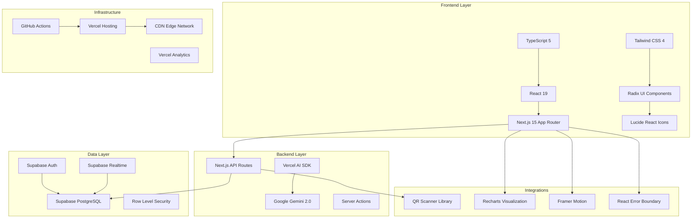

### 2.2 Core Dependencies

- **Frontend**: Next.js 15 (App Router), React 19, TypeScript 5, Tailwind CSS 4, Radix UI, Lucide React
- **Backend**: Next.js API routes (serverless on Vercel), Vercel AI SDK, Google Gemini 2.0 Flash
- **Database**: Supabase (PostgreSQL, Auth, Realtime)
- **Realtime**: Supabase Realtime channels
- **Hosting/Infra**: Vercel (Edge/Node runtimes), Vercel Analytics, Speed Insights
- **CI/Automation**: GitHub Actions (`.github/workflows`)
- **Charts/Visualization**: Recharts
- **QR**: `qr-scanner` (camera), `react-qr-code`/`qrcode` (generation)
- **State/UX**: Custom hooks, Context providers (LoadingBar, Notifications), `next-themes`

Key packages (`package.json`)
- `next@^15.3.5`, `react@^19.1.0`, `typescript@^5`
- `@supabase/supabase-js@^2.49.4`, `@supabase/ssr@^0.6.1`
- `ai@^4.3.16`, `@ai-sdk/google@^1.2.18`
- `tailwindcss@^4`, Radix UI components, `lucide-react`

## 3. Architecture Style and Rationale

**Style**: Modular monolith with serverless endpoints (N-tier)

- **Presentation/UI**: App Router pages and client components under `app/` with shared UI in `components/`
- **Domain/Logic**: Feature modules per route (sports, bookings, notifications, admin, assistant)
- **Data/Integration**: Supabase PostgreSQL, Auth, Realtime; server-only operations via Next API routes using Service Role Key for automation

Why this style
- **Simplicity and velocity**: Single deployable unit reduces operational overhead for a university team
- **Cost-efficient serverless**: Scales with traffic automatically; zero idle cost
- **SSR/SPA hybrid**: App Router enables selective SSR for auth-sensitive routes
- **Realtime**: Supabase channels integrate cleanly with client hooks
- **Clear separation** of concerns by folder without microservice complexity

## 4. Architecture Diagrams

### 4.1 Logical (High-level modules)
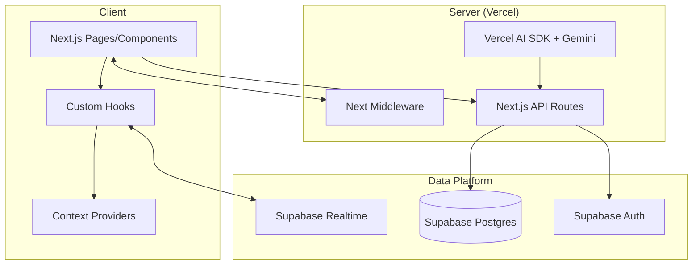

### 4.2 Deployment
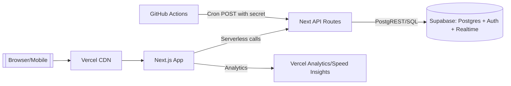

### 4.3 Data Flow (Booking + Realtime + QR)
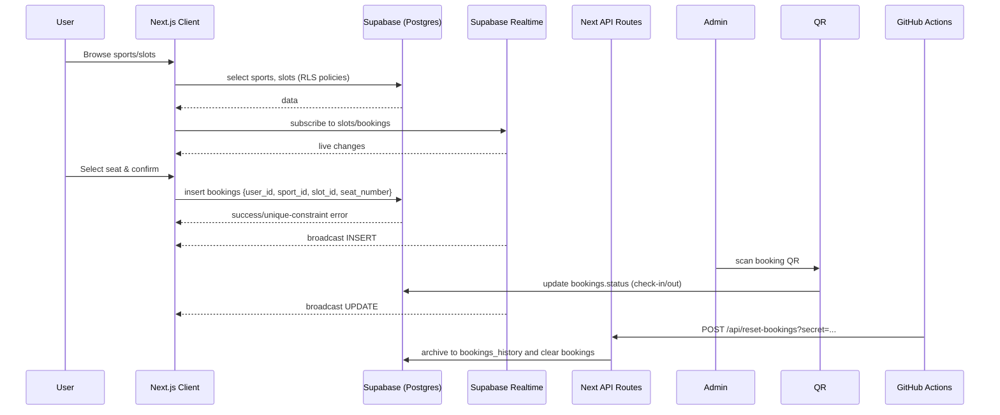

## 5. Module/Folder Responsibilities

- `app/`
  - `(auth)/`: Auth flows (login, signup, onboarding, password/reset, set password, error)
  - `(main)/`: User-facing sections (sports list/details, slots, seats, my bookings, history, profile, notifications, dashboard, rules, terms)
  - `admin/`: Admin dashboard (bookings, bookings-history, slots, sports, notifications, QR scanner camera/iot)
  - `api/`: Serverless endpoints: chat, check-profile, check-user-exists, reset-bookings, sports/activate, sports/deactivate
  - `assistant/`: AI assistant page/components
  - `middleware.ts`: Route protection and session refresh via Supabase SSR cookies
- `components/`
  - `ui/`: Shadcn UI primitives
  - `providers/`: LoadingBarProvider, NotificationProvider
  - `motion-primitives/`: Animation utilities
  - global components: navbars, hero, footers, etc.
- `hooks/`
  - `useRealtimeSubscription.tsx`: Robust Supabase Realtime subscription with reconnection, debouncing, and health checks
  - `useCurrentUser.tsx`: Client-side profile fetch with auth listener
- `utils/supabase/`
  - `client.ts`: Browser client with anon key
  - `server.ts`: Server client with SSR cookies
  - `middleware.ts`: SSR session and route gating logic
- `lib/`
  - `auth.ts`, `getUserWithProfile.ts`, `check-profile.ts`, `date.ts`, `utils.ts`: Server utilities, redirects, date helpers (IST)
- `.github/workflows/`
  - `reset-bookings.yml`: Daily archival
  - `activate-sports.yml`, `deactivate-sports.yml`: Sunday off/Monday on with retries and IST timing

## 6. Detailed Data Flows

### 6.1 Sports and Slots
- Listing: Client queries `sports` and `slots` for a sport (`app/(main)/sports/[id]/slots`)
- Filtering: `gender` and `allowed_user_type` applied on UI; only active `is_active` slots considered
- Realtime: subscribe to `slots` table filtered by `sport_id`

### 6.2 Seat Selection and Booking
- Pre-checks: Auth required; profile existence enforced; sport/slot `is_active` required
- Constraints:
  - One seat per user per slot per day (checked in code; unique constraints recommended at DB)
  - Time conflict prevention across user’s bookings
  - Gender and user_type eligibility enforced client-side before insert
- Insert: `bookings` row `{ user_id, sport_id, slot_id, booking_date, seat_number, status='booked' }`
- Realtime: Other clients receive live updates to disable seats

### 6.3 Attendance (QR Scanners)
- Camera scanner: Uses `qr-scanner` to read booking QR; updates `bookings.status` to `checked-in` or `checked-out` with timestamps; includes robust long-session management, retries, and audio feedback
- Automated scanner (IoT style): Input-first UX for wedge scanners; identical status transitions and validations; offline queuing and retry on reconnect
- Transitions: `booked → checked-in → checked-out`; invalid transitions blocked with friendly errors

### 6.4 Notifications
- Admin creates/edits notifications; users see real-time active notices via `NotificationProvider` subscription to `notifications`

### 6.5 Automation (GitHub Actions)
- Deactivate sports on Sunday (IST) and reactivate Monday via `/api/sports/deactivate` and `/api/sports/activate` using `BACKUP_CRON_SECRET`
- Nightly archival: `/api/reset-bookings` moves `bookings` → `bookings_history` and clears `bookings`

### 6.6 AI Assistant
- Endpoint: `app/api/chat/route.ts`
- Inputs: `messages[]` and optional `sportsData` snapshot
- Processing: Server-side validation/sanitization; selective, pre-validated booking links (<5) with strict time rules; notification awareness; audit logs; basic rate limiting
- Model: Google Gemini 2.0 Flash via Vercel AI SDK

### 6.7 Authentication Flow Diagram

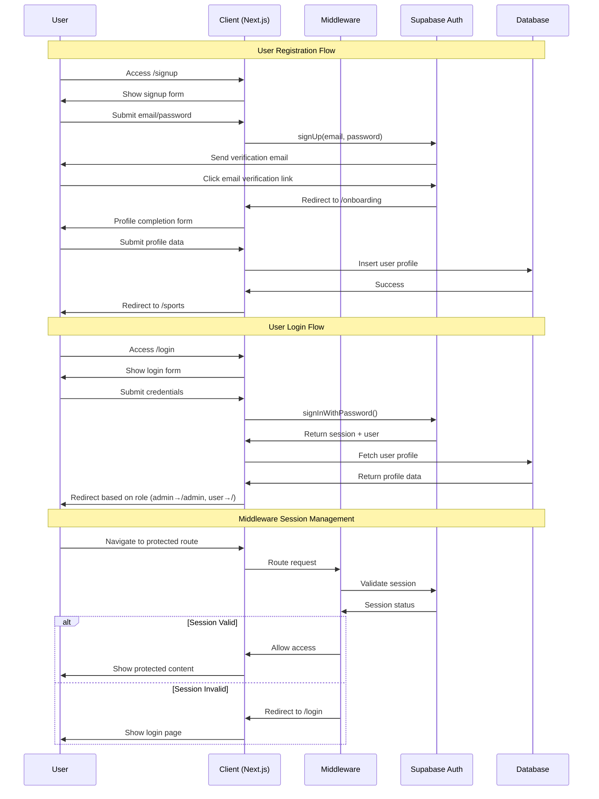

### 6.8 Booking Flow with Real-time Updates

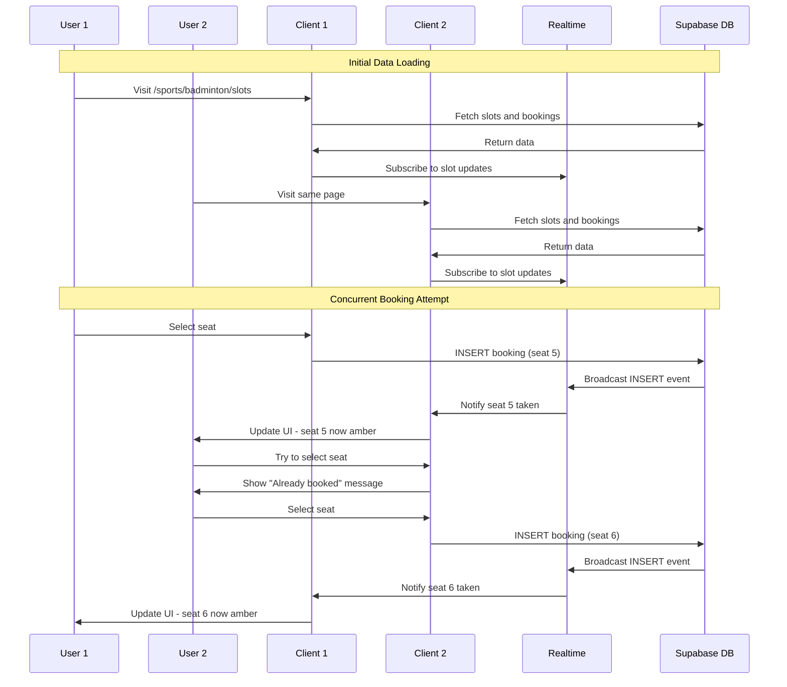

### 6.9 QR Code Check-in Flow

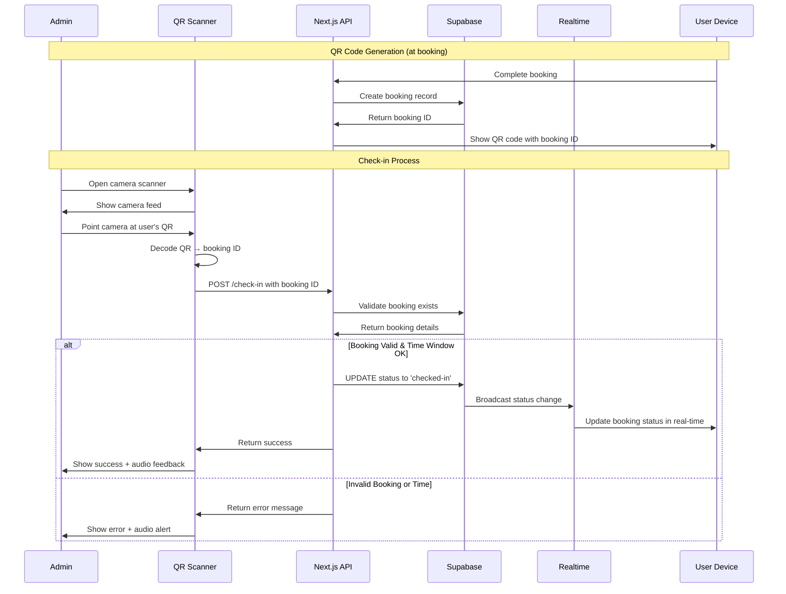

## 7. Database Schema

Core tables
- `profiles`: `id` (uuid, pk, auth.uid), `first_name`, `last_name`, `gender`, `user_type`, `role`, `prn`, `course`, `phone_number`, `email`, `created_at`
- `sports`: `id` (uuid, pk), `name`, `image_url`, `seat_limit`, `is_active` (bool), `created_at`
- `slots`: `id` (uuid, pk), `sport_id` (fk→sports), `start_time`, `end_time`, `gender` ('male'|'female'|'any'), `allowed_user_type` ('student'|'faculty'|'any'), `is_active` (bool), `created_at`
- `bookings`: `id` (uuid, pk), `user_id` (fk→profiles), `slot_id` (fk→slots), `sport_id` (fk→sports), `booking_date` (date), `seat_number` (int), `status` ('booked'|'checked-in'|'checked-out'), `checked_in_at`, `checked_out_at`, `created_at`
- `bookings_history`: archived bookings
- `notifications`: `id` (uuid, pk), `title`, `message`, `type` ('urgent'|'maintenance'|'general'), `is_active` (bool), `created_by` (fk→profiles), `created_at`
- `user_feedback`: `id` (uuid, pk), `user_id` (fk→profiles), `feedback_text`, `rating`, `category`, `status`, `created_at`

Recommended constraints and indexes
- `bookings`: unique (`slot_id`, `booking_date`, `seat_number`) to enforce seat integrity
- `bookings`: index (`user_id`, `booking_date`) for user-day queries
- `slots`: index (`sport_id`, `is_active`), (`gender`, `allowed_user_type`)
- `sports`: index (`is_active`)

ER Diagram
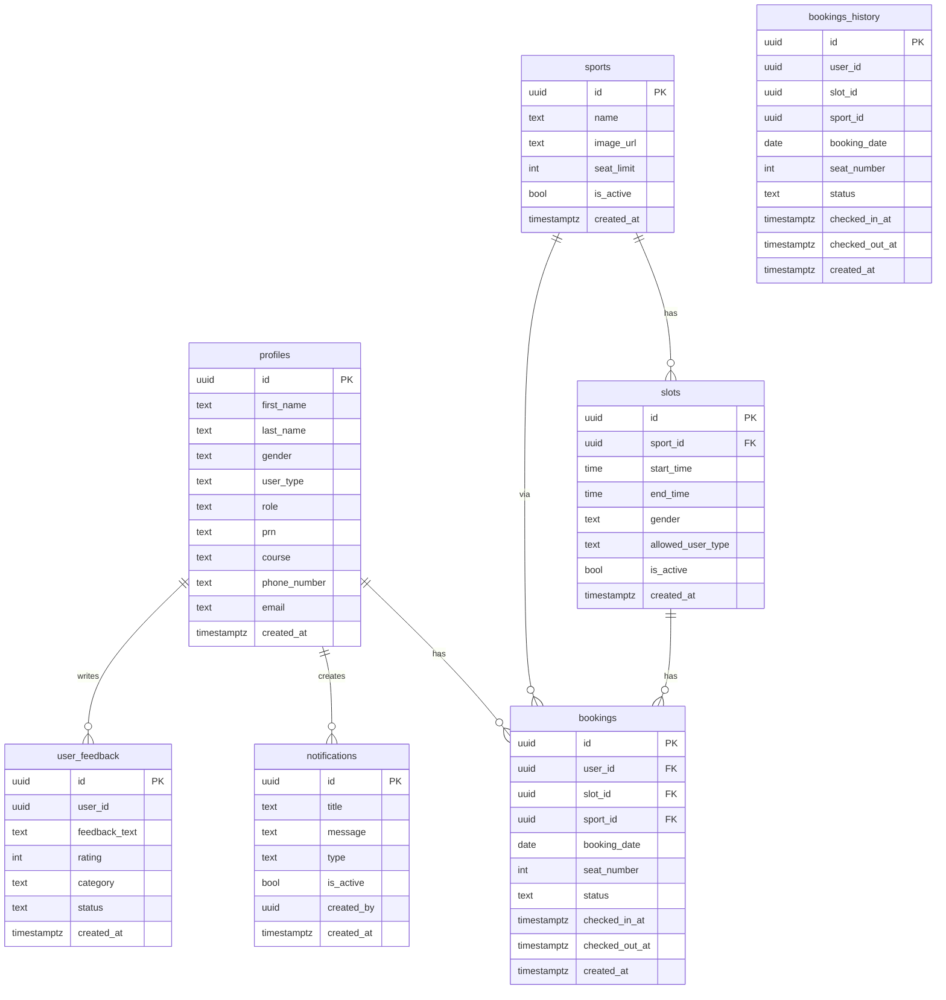

## 8. AI Usage and Integration

- **Endpoint**: `app/api/chat/route.ts`
- **SDK**: Vercel AI SDK with `google("gemini-2.0-flash")`
- **Security**: Prompt injection detection, content sanitization, sensitive data filters, basic rate limit, audit logs with request IDs
- **Context-aware**: Accepts sanitized sports/slots/user snapshot; server precomputes slot status (ACTIVE/FULL/EXPIRED), booking URLs, and notification summaries
- **Output policy**: Shows at most 3–5 booking links; never expired/full; respects gender/user_type; IST time formatting; uses navigation links

## 9. Deployment and Environment Setup

Local
1) Node.js 18+, pnpm or npm
2) Install deps: `npm install`
3) Configure `.env.local`:
   - `NEXT_PUBLIC_SUPABASE_URL`
   - `NEXT_PUBLIC_SUPABASE_ANON_KEY`
   - `SUPABASE_SERVICE_ROLE_KEY`
   - `BACKUP_CRON_SECRET`
   - `GOOGLE_GENERATIVE_AI_API_KEY`
4) Run: `npm run dev` → http://localhost:3000

Production (Vercel)
- Connect GitHub repo to Vercel
- Set environment variables (same keys as above) in Vercel Project Settings
- Build command: `next build`, Start: `next start` (Vercel auto)
- Analytics: Vercel Analytics + Speed Insights toggled in project

Automation (GitHub Actions)
- Secrets required: `BACKUP_CRON_SECRET`, `RESET_BOOKINGS_API_URL`, `ACTIVATE_SPORTS_API_URL`, `DEACTIVATE_SPORTS_API_URL`
- Workflows schedule POST requests with retries and 10-min timeouts

## 10. Security Practices

### 10.1 Security Architecture Overview

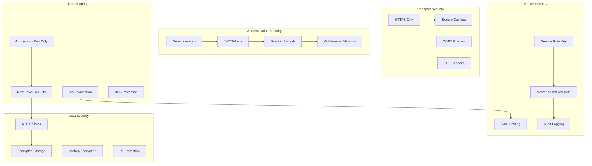

### 10.2 Security Layers

- **Auth & Sessions**: Supabase SSR with secure cookies, session refresh in `middleware.ts`
- **Route Protection**: Middleware redirects unauthenticated users; prevents access to auth pages when logged in
- **Server-only Privileges**: Service Role Key used only in server API routes gated by secret query (`BACKUP_CRON_SECRET`)
- **RLS**: Use Supabase Row-Level Security and policies (expected on tables) to restrict client access
- **Input Validation**: AI API validates messages structure, sanitizes content, blocks prompt injection and sensitive patterns
- **Time & Access Validation**: Gender/user_type checks, slot active checks, time windows (e.g., check-in only within 10 minutes before start)
- **Least Privilege**: Client uses anon key; server operations use service role for automation endpoints only
- **Secrets Management**: Environment variables stored in Vercel and GitHub Secrets

### 10.3 Data Access Control Matrix

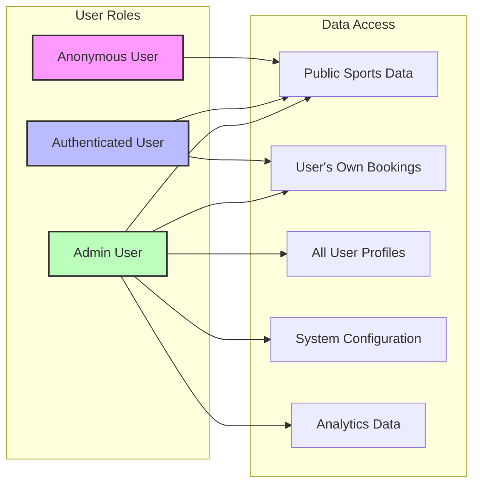

## 11. Third-Party Integrations

- Supabase: Postgres, Auth, Realtime, RPC (`user_exists_by_email`)
- Google Gemini 2.0 Flash via Vercel AI SDK
- Vercel: Hosting, Analytics, Speed Insights
- QR: `qr-scanner`, `qrcode`, `react-qr-code`
- UI: Radix UI, Shadcn, Lucide React
- Charts: Recharts

## 12. Developer Guidelines

### 12.1 Development Workflow

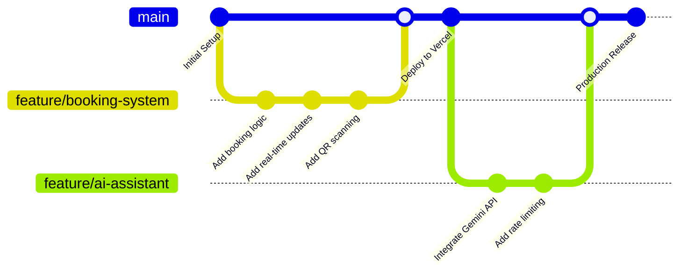

### 12.2 CI/CD Pipeline

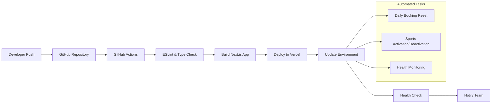

### 12.3 Monitoring and Alerting

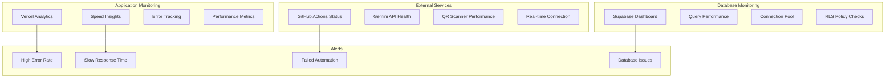

Understand the codebase
- Start at `app/layout.tsx` for providers
- Auth flows: `app/(auth)/...` with SSR gating in `middleware.ts`
- Core booking UX: `app/(main)/sports`, `slots`, `seats` with realtime hook `hooks/useRealtimeSubscription`
- Admin tools: `app/admin/...` including QR scanners and notifications
- Automation APIs: `app/api/reset-bookings`, `app/api/sports/(de)activate`
- AI: `app/api/chat/route.ts` and `app/assistant`

Run locally
- `npm install`
- Set `.env.local`
- `npm run dev`

Modify safely
- Prefer server checks for critical writes (booking, status changes)
- Keep `middleware.ts` in sync when adding public routes
- Use `utils/supabase/server.ts` for server code and `client.ts` on client
- For realtime, use `useRealtimeSubscription` and filter at channel level
- Add DB constraints for seat uniqueness; index frequent queries

Testing tips
- Use cURL for automation endpoints (with `?secret=`)
- Verify realtime by opening two browsers and booking the same slot
- Test QR flows with a booking QR from success page

## 13. Known Issues and Edge Cases

- Word rendering of Mermaid: Diagrams included in Mermaid; rendering may require conversion step (export to images if needed)
- Timezones: All validations aligned to IST; ensure server env is stable
- Race conditions: Prevented by DB unique constraints; UI still handles `23505` errors gracefully
- Service Role Key exposure: Must never be shipped to client; keep API routes server-only and gate by secret
- Network/offline: QR IoT and camera scanners implement retries and offline queues; still dependent on stable network
- Camera permissions: Production requires HTTPS; camera selection can vary across devices
- Large realtime load: Channel reconnection and debouncing implemented; monitor Supabase quotas
- Rate limiting: AI API has basic message-count check; consider platform-wide rate limiting

## 14. Roadmap / TODOs

- Add server-side guards for booking conflict checks (duplicate of client guard) with DB constraints where applicable
- Centralize time window validation on server and store as DB constraints where feasible
- Add comprehensive integration tests and e2e flows
- Observability: Structured logs, alerts for automation endpoints and AI failures
- Export Mermaid diagrams to images during CI for Word/PDF packaging
- Harden automation APIs (move from query secret to signed header or HMAC)

## 15. Appendix: Key File Index

- Auth & session: `app/middleware.ts`, `utils/supabase/{server,client,middleware}.ts`
- User flows: `app/(main)/sports/...`, `app/(main)/my-bookings/...`
- Realtime: `hooks/useRealtimeSubscription.tsx`
- Admin: `app/admin/...`, QR scanners under `app/admin/qr-scanner/{camera,iot}/page.tsx`
- APIs: `app/api/{chat,check-profile,check-user-exists,reset-bookings,sports/(activate|deactivate)}/route.ts`
- Providers: `components/providers/{LoadingBarProvider,NotificationProvider}.tsx`
- Docs: `README.md`

---

## Diagram Index

This document contains the following **comprehensive diagrams** for complete system understanding:

### **System Architecture (Sections 2-4)**
- **Technology Stack Overview**: Complete tech stack with layer relationships
- **Logical Architecture**: High-level system modules and interactions
- **Deployment Architecture**: Vercel hosting and CDN configuration
- **Data Flow**: Booking + Real-time + QR scanning sequences

### **Process Flows (Section 6)**
- **Authentication Flow**: Registration, login, and middleware session management
- **Booking Flow with Real-time**: Concurrent user booking with live updates
- **QR Code Check-in Flow**: Complete attendance tracking process

### **Security & Operations (Sections 10-12)**
- **Security Architecture**: Multi-layer security model
- **Data Access Control Matrix**: Role-based access permissions
- **Development Workflow**: Git flow and feature development
- **CI/CD Pipeline**: Automated deployment and testing
- **Monitoring and Alerting**: Comprehensive system health tracking

### **Database Design (Section 7)**
- **ER Diagram**: Complete database relationships and constraints
- **Class Diagram**: Data model structure and relationships

This document is intentionally written as a handover-ready, high-signal reference for new engineers and external reviewers.
