# Courtside Code Reference Manual

Version: 1.0  
Owner/Maintainer: MIT-WPU — sports.mitwpu.edu.in  
Original Creator: Subhajit Dolai ([LinkedIn](https://www.linkedin.com/in/subhajit-dolai))  

---

## Table of Contents

1. [Overview](#overview)
2. [Authentication System](#authentication-system)
3. [Main Application Routes](#main-application-routes)
4. [Admin Dashboard](#admin-dashboard)
5. [API Endpoints](#api-endpoints)
6. [AI Assistant](#ai-assistant)
7. [Components Library](#components-library)
8. [Custom Hooks](#custom-hooks)
9. [Utility Libraries](#utility-libraries)
10. [Database Integration](#database-integration)
11. [Configuration Files](#configuration-files)

---

## Overview

This document provides exhaustive documentation for every file, function, variable, component, and configuration in the Courtside codebase. It's designed for developers who need to understand, modify, or extend the system.

### System Architecture Map


---

## Authentication System

### `/app/(auth)/login/actions.ts`
**Purpose**: Server-side authentication actions using Supabase Auth

#### Functions:

##### `login(formData: FormData)`
- **Type**: Server Action
- **Parameters**: 
  - `formData: FormData` - Contains `email` and `password`
- **Returns**: `Promise<{ error: string | null }>`
- **Features**:
  - Email/password authentication via Supabase
  - Role-based redirect (admin → `/admin`, users → `/`)
  - Error handling for invalid credentials
- **Dependencies**: `@/utils/supabase/server`, `next/navigation`

##### `signup(formData: FormData)`
- **Type**: Server Action
- **Parameters**: 
  - `formData: FormData` - Contains `email` and `password`
- **Validation**: 
  - Enforces `@mitwpu.edu.in` email domain
  - Checks for existing users in `profiles` table
- **Returns**: `Promise<{ error?: string, success?: boolean }>`
- **Error Types**: Network errors, duplicate emails, invalid domain

##### `logout()`
- **Type**: Server Action
- **Features**:
  - Clears Supabase session
  - Revalidates layout cache
  - Force redirect to `/login`

---

### `/app/(auth)/login/components/LoginForm.tsx`
**Purpose**: Client-side login form component with advanced UX

#### Component: `LoginForm`
- **Type**: React FC with form validation
- **Props**: `React.ComponentPropsWithoutRef<"form">`
- **State Variables**:
  - `isLoading: boolean` - Form submission state
  - `showPassword: boolean` - Password visibility toggle
  - `alertOpen: boolean` - Error dialog state
  - `alertTitle/Description: string` - Error message content
  - `alertAction: (() => void) | null` - Optional follow-up action

#### Key Features:
- **Password Visibility**: Eye/EyeOff icons toggle password display
- **Error Handling**: Context-aware error messages:
  - Invalid credentials → Custom dialog
  - Network errors → Retry suggestions
  - Banned accounts → Redirect to `/banned`
- **UX Optimizations**:
  - Route prefetching for `/` and `/admin`
  - Loading states with spinner
  - Form validation
- **Dependencies**: `useGlobalLoadingBar`, `useRouter`, `toast`

---

### `/app/(auth)/onboarding/actions.ts`
**Purpose**: New user profile completion

#### Function: `completeOnboarding(prevState: unknown, formData: FormData)`
- **Type**: Server Action
- **Parameters**:
  - `prevState: unknown` - Previous form state (for `useActionState`)
  - `formData: FormData` - Profile information
- **Profile Fields**:
  - `first_name, last_name: string`
  - `prn: string` - Student PRN or Faculty ID
  - `email: string` - Auto-filled from auth user
  - `course: string` - Course/Department
  - `gender: 'male' | 'female'`
  - `phone_number: string`
  - `user_type: 'student' | 'faculty'` - Defaults to 'student'
- **Redirect**: Success → `/sports`

---

### `/app/(auth)/onboarding/components/onboardingForm.tsx`
**Purpose**: Multi-step profile creation form

#### Component: `OnboardingForm`
- **State Management**:
  - `userType: '' | 'student' | 'faculty'` - Determines form fields
  - `gender: string` - Required selection
  - `formError: string | null` - Client-side validation
- **Form Sections**:
  1. **Personal Information**: First/Last name
  2. **Account Type**: Student vs Faculty selection
  3. **Academic Details**: PRN/Faculty ID, Course/Department (conditional)
  4. **Contact & Personal**: Phone, Gender
- **Validation**: 
  - Required field validation
  - Dropdown selection enforcement
  - Server-side error display
- **UX Features**:
  - Conditional field rendering based on user type
  - Loading states during submission
  - Responsive design with Tailwind classes

---

### `/app/(auth)/signup/components/SignupForm.tsx`
**Purpose**: User registration with verification flow

#### Component: `SignupForm`
- **State Variables**:
  - `isLoading: boolean` - Submission state
  - `showPassword/showConfirmPassword: boolean` - Password visibility
  - `showSuccessDialog: boolean` - Email verification modal
  - `userEmail: string` - Stored for success dialog
  - `confirmPassword: string` - Client-side password matching
  - `passwordError: string` - Password validation errors
  - `alertOpen/Title/Description: boolean/string` - Error handling

#### Features:
- **Password Validation**: Client-side password confirmation
- **Email Verification**: Pre-checks for existing users via `/api/check-user-exists`
- **Success Flow**: Beautiful email verification dialog with:
  - Animated check icon with ripple effects
  - Email display card
  - Pro tips for spam folder checking
- **Error States**: Network errors, existing users, invalid domains

#### Success Dialog Components:
- **Motion Effects**: Framer Motion animations for icon and content
- **Visual Elements**: Gradient backgrounds, shimmer effects
- **User Guidance**: Email location tips and next steps

---

## Main Application Routes

### `/app/(main)/dashboard/components/dashboard-client.tsx`
**Purpose**: Main analytics dashboard with interactive charts

#### Component: `DashboardClient`
- **Props**:
  - `bookings: any[]` - Current active bookings
  - `bookingHistory: any[]` - Historical booking data
  - `profiles: any[]` - User profiles for demographics
  - `sports: any[]` - Available sports
  - `slots: any[]` - Time slots configuration

#### State Management:
- `activeTab: 'overview' | 'bookings' | 'users'` - Tab navigation
- `isInitialLoad: boolean` - Loading animation control

#### Key Features:

##### **Tab System**:
1. **Overview Tab**: Key metrics and trends
   - User count, active sports, available slots, total bookings
   - Booking trends chart (weekly patterns)
   - Sports distribution (pie/bar chart)

2. **Bookings Tab**: Detailed booking analytics
   - Bookings overview with time series
   - Slot utilization patterns
   - Peak hours and usage analytics

3. **Users Tab**: User demographics and growth
   - Gender distribution charts
   - User type breakdown (Student/Faculty)
   - User growth analytics with time controls

##### **Chart Components** (Lazy Loaded):
- `BookingsOverview` - Time series booking patterns
- `SportsDistribution` - Popular sports analysis  
- `SlotUtilization` - Time slot efficiency
- `BookingTrends` - Weekly booking activities

##### **Advanced User Growth Chart**:
- **Time Range Controls**: 6 months, 1 year, all time
- **View Modes**: Cumulative vs Monthly growth
- **Statistics Panel**: 
  - Total new users, average per month
  - Growth rate calculations, peak month identification
- **Interactive Features**: Hover tooltips, responsive design
- **Chart Library**: Recharts with custom styling

#### Error Handling:
- **Error Boundaries**: Graceful chart failure recovery
- **Loading Skeletons**: Shimmer effects during data loading
- **Fallback Components**: Error messages with retry options

---

### `/app/(main)/sports/sports-page-client.tsx`
**Purpose**: Sports selection interface with real-time updates

#### Component: `SportsPageClient`
- **Props**: `{ sports: Sport[] }` - Initial sports data from server
- **Sport Interface**:
  ```typescript
  interface Sport {
    id: string
    name: string
    image_url: string | null
  }
  ```

#### State Management:
- `loadingId: string | null` - Tracks which sport is being loaded
- `showConnectionStatus: boolean` - Real-time connection indicator
- `isLoading: boolean` - Initial page load state
- `error: string | null` - Error message display
- `debouncedIsConnected: boolean` - Stable connection status

#### Real-time Features:
- **Supabase Realtime**: Live sports activation/deactivation
- **Connection Status**: Visual indicators for online/offline
- **Debounced Updates**: Prevents UI flickering during connection changes
- **Error Recovery**: Fallback to initial data on network errors

#### Optimizations:
- **Image Loading**: Progressive loading with blur placeholders
- **Route Prefetching**: Pre-loads slot pages for faster navigation
- **Memoized Components**: `SportCard` and `SportsList` prevent unnecessary re-renders
- **Custom Comparison**: Optimized memoization for sport cards

#### Sub-Components:

##### `SportCard` (Memoized)
- **Image Handling**: Error states, loading skeletons, responsive sizing
- **Visual Effects**: Hover animations, gradient overlays
- **Accessibility**: Alt text, keyboard navigation
- **Performance**: Priority loading for first 4 images

##### `LoadingSkeleton`
- **Shimmer Effects**: Animated loading placeholders
- **Responsive Grid**: Matches actual sport card layout
- **Skeleton Anatomy**: Mimics real card structure

---

## Admin Dashboard

### `/app/admin/bookings/components/BookingDetailsDialog.tsx`
**Purpose**: Detailed booking information modal for admin review

#### Component: `BookingDetailsModal`
- **Props**:
  - `bookingId: string | null` - ID of booking to display
  - `isOpen: boolean` - Modal visibility state
  - `onClose: () => void` - Close callback

#### Data Interfaces:
```typescript
interface Booking {
  id: string
  status: 'booked' | 'checked-in' | 'checked-out'
  created_at: string
  seat_number: number
  checked_in_at: string | null
  checked_out_at: string | null
  booking_date: string
  profiles: Profile
  sports: Sport
  slots: Slot
}

interface Profile {
  first_name: string
  last_name: string
  prn: string
  gender: string
  user_type: string
  phone_number: string
  email: string
  course: string
}
```

#### Features:

##### **Data Fetching**:
- **Supabase Query**: Joins profiles, sports, and slots tables
- **Error Handling**: Loading states and error recovery
- **Data Sanitization**: Multiple fallback paths for missing data

##### **Information Sections**:
1. **Basic Info**: User, sport, date, time, seat number, PRN
2. **User Details**: Email, phone, gender, user type, department
3. **Timeline**: Booking creation, check-in, check-out timestamps
4. **Booking ID**: Copyable UUID with copy confirmation

##### **Status System**:
- **Status Badges**: Color-coded with icons (Clock, CheckCircle2, XCircle)
- **Status Colors**: Yellow (booked), Blue (checked-in), Gray (checked-out)
- **Dark Mode Support**: Adaptive colors for both themes

##### **Utility Functions**:
- `getUserName()` - Safe name concatenation with fallbacks
- `getUserEmail()` - Email extraction with null handling
- `formatTimestamp()` - Date formatting with error handling
- `formatTime12hr()` - 24h to 12h time conversion
- `getStatusBadge()` - Dynamic status badge generation

---

## AI Assistant

### `/app/assistant/components/AiAssistant.tsx`
**Purpose**: Conversational AI interface for booking assistance and information

#### Component: `AiAssistant`
- **Props**: `{ initialData: AssistantData }`
- **AI SDK**: Uses `@ai-sdk/react` with custom chat configuration

#### AssistantData Interface:
```typescript
interface AssistantData {
  sportsWithSlots: any[]
  facilityStats: {
    totalSports: number
    totalSlots: number
    todayBookings: number
    currentDate: string
  }
  currentUser: {
    user_type: string
    gender: string
  } | null
  notifications: NotificationItem[]
  lastUpdated: string
}
```

#### State Management:
- `copiedMessageId: string | null` - Copy button feedback
- `showSuggestions: boolean` - Quick suggestion visibility
- `rateLimitError: object` - Rate limiting with countdown
- `messagesEndRef: RefObject` - Auto-scroll reference

#### Advanced Features:

##### **Rate Limiting System**:
- **Error Detection**: Detects 429 errors and rate limit messages
- **Countdown Timer**: Visual countdown until retry allowed
- **Auto-Recovery**: Automatic re-enable after cooldown
- **User Feedback**: Clear messaging about wait times

##### **Message System**:
- **Dynamic Width**: Content-based message bubble sizing
- **Rich Markdown**: Custom ReactMarkdown components:
  - **Links**: External link detection with icons
  - **Code Blocks**: Syntax highlighting and copy functionality
  - **Lists**: Custom bullet styling
  - **Emphasis**: Highlighted text with background colors
- **Copy Feature**: Per-message copy with feedback icons
- **Auto-scroll**: Smart scrolling to latest messages

##### **Quick Suggestions**:
- **Contextual Prompts**: Pre-defined helpful queries
- **Interactive Grid**: Responsive suggestion layout
- **Smart Hiding**: Disappears after first interaction
- **Rate-Limit Aware**: Disabled during cooldowns

##### **Input Handling**:
- **Auto-Focus**: Maintains input focus throughout conversation
- **Character Counter**: Shows input length for long messages
- **Loading States**: Visual feedback during AI processing
- **Error Recovery**: Graceful handling of network issues

#### UX Optimizations:
- **Responsive Design**: Mobile-first layout with adaptive sizing
- **Theme Support**: Full dark/light mode compatibility
- **Animation Effects**: Smooth transitions and loading indicators
- **Accessibility**: Proper ARIA labels and keyboard navigation

### AI Assistant Component Flow


---

## Components Library

### Shadcn UI Components (`/components/ui/`)

#### `/components/ui/button.tsx`
**Purpose**: Base button component with variant system

#### Component: `Button`
- **Base**: Built on Radix UI Slot for composition
- **Styling**: Class Variance Authority (CVA) for variant management

#### Variant System:
```typescript
const buttonVariants = cva(
  // Base classes
  "inline-flex items-center justify-center gap-2 whitespace-nowrap rounded-md text-sm font-medium transition-all disabled:pointer-events-none disabled:opacity-50",
  {
    variants: {
      variant: {
        default: "bg-primary text-primary-foreground shadow-xs hover:bg-primary/90",
        destructive: "bg-destructive text-white shadow-xs hover:bg-destructive/90",
        outline: "border bg-background shadow-xs hover:bg-accent hover:text-accent-foreground",
        secondary: "bg-secondary text-secondary-foreground shadow-xs hover:bg-secondary/80",
        ghost: "hover:bg-accent hover:text-accent-foreground",
        link: "text-primary underline-offset-4 hover:underline"
      },
      size: {
        default: "h-9 px-4 py-2 has-[>svg]:px-3",
        sm: "h-8 rounded-md gap-1.5 px-3 has-[>svg]:px-2.5",
        lg: "h-10 rounded-md px-6 has-[>svg]:px-4",
        icon: "size-9"
      }
    }
  }
)
```

#### Features:
- **Composition Pattern**: `asChild` prop for component composition
- **Icon Support**: Automatic sizing and spacing for SVG icons
- **Accessibility**: Focus-visible states and ARIA support
- **TypeScript**: Full type safety with variant props
- **Dark Mode**: Adaptive colors across themes

#### Other UI Components:

##### `/components/ui/card.tsx`
- **Purpose**: Container component with consistent styling
- **Variants**: Basic card, with header, footer, content sections
- **Usage**: Dashboard widgets, forms, content blocks

##### `/components/ui/input.tsx`
- **Purpose**: Form input field with validation states
- **Features**: Error states, disabled states, focus rings
- **Integration**: React Hook Form compatibility

##### `/components/ui/label.tsx`
- **Purpose**: Form label with accessibility features
- **Features**: Required indicators, help text, error states

##### `/components/ui/select.tsx`
- **Purpose**: Dropdown selection component
- **Base**: Radix UI Select primitive
- **Features**: Search, multi-select, custom options

##### `/components/ui/dialog.tsx`
- **Purpose**: Modal dialog system
- **Features**: Backdrop, focus trap, escape key handling
- **Usage**: Booking confirmations, admin forms

##### `/components/ui/badge.tsx`
- **Purpose**: Status and category indicators
- **Variants**: Success, warning, error, info
- **Usage**: Booking status, user types, notifications

##### `/components/ui/avatar.tsx`
- **Purpose**: User profile image display
- **Features**: Fallback initials, loading states
- **Usage**: User profiles, team displays

##### `/components/ui/skeleton.tsx`
- **Purpose**: Loading placeholder component
- **Features**: Shimmer animations, responsive sizing
- **Usage**: Data loading states

##### `/components/ui/tabs.tsx`
- **Purpose**: Tab navigation system
- **Features**: Keyboard navigation, content switching
- **Usage**: Dashboard sections, settings panels

##### `/components/ui/table.tsx`
- **Purpose**: Data table component
- **Features**: Sorting, pagination, responsive design
- **Usage**: Booking lists, admin data tables

##### `/components/ui/tooltip.tsx`
- **Purpose**: Contextual help system
- **Features**: Hover/focus triggers, positioning
- **Usage**: Icon explanations, help text

##### `/components/ui/alert.tsx`
- **Purpose**: Notification and message display
- **Variants**: Info, success, warning, error
- **Usage**: Form feedback, system messages

##### `/components/ui/checkbox.tsx`
- **Purpose**: Boolean input component
- **Features**: Indeterminate state, custom styling
- **Usage**: Terms acceptance, multi-select

##### `/components/ui/switch.tsx`
- **Purpose**: Toggle input component
- **Features**: On/off states, animations
- **Usage**: Settings toggles, preferences

##### `/components/ui/separator.tsx`
- **Purpose**: Visual content divider
- **Features**: Horizontal/vertical, spacing variants
- **Usage**: Content sections, menu dividers

##### `/components/ui/accordion.tsx`
- **Purpose**: Collapsible content sections
- **Features**: Multiple/single expand, animations
- **Usage**: FAQ sections, settings groups

##### `/components/ui/calendar.tsx`
- **Purpose**: Date selection component
- **Features**: Month navigation, date ranges
- **Usage**: Booking date selection

##### `/components/ui/popover.tsx`
- **Purpose**: Floating content container
- **Features**: Positioning, click outside to close
- **Usage**: Dropdown menus, date pickers

##### `/components/ui/scroll-area.tsx`
- **Purpose**: Custom scrollbar container
- **Features**: Cross-browser scrollbars, smooth scrolling
- **Usage**: Long content lists, chat messages

##### `/components/ui/dropdown-menu.tsx`
- **Purpose**: Contextual menu system
- **Features**: Keyboard navigation, sub-menus
- **Usage**: User menus, action menus

##### `/components/ui/navigation-menu.tsx`
- **Purpose**: Site navigation component
- **Features**: Dropdown sub-menus, responsive design
- **Usage**: Main site navigation

##### `/components/ui/alert-dialog.tsx`
- **Purpose**: Confirmation dialog system
- **Features**: Destructive actions, cancel/confirm
- **Usage**: Delete confirmations, warnings

##### `/components/ui/text-effect.tsx`
- **Purpose**: Animated text components
- **Features**: Typewriter, fade-in, scroll effects
- **Usage**: Hero sections, loading states

##### `/components/ui/progressive-blur.tsx`
- **Purpose**: Progressive image blur effect
- **Features**: Loading transitions, performance optimized
- **Usage**: Image loading states

##### `/components/ui/animated-group.tsx`
- **Purpose**: Grouped animation container
- **Features**: Stagger animations, entrance effects
- **Usage**: List items, card grids

##### `/components/ui/date-range-picker.tsx`
- **Purpose**: Date range selection component
- **Features**: Start/end date selection, presets
- **Usage**: Booking history filters, reports

##### `/components/ui/morphingPopoverTextarea.tsx`
- **Purpose**: Animated textarea in popover
- **Features**: Smooth expand/collapse, auto-resize
- **Usage**: Quick feedback forms, comments

---

## Custom Hooks

### `/hooks/useRealtimeSubscription.tsx`
**Purpose**: Robust Supabase Realtime integration with connection management

#### Hook: `useRealtimeSubscription<T>`
- **Generic Type**: `T` - Data type for the subscription
- **Parameters**:
  - `table: string` - Supabase table name
  - `initialData: T[]` - Server-side initial data
  - `fetchData: () => Promise<T[]>` - Data fetching function
- **Returns**: `{ data: T[], isConnected: boolean }`

#### Advanced Features:

##### **Connection Management**:
- **Health Monitoring**: Periodic connection health checks
- **Automatic Reconnection**: Exponential backoff on disconnection
- **Debounced Updates**: Prevents rapid-fire state changes
- **Error Recovery**: Graceful fallback to initial data

##### **Real-time Events**:
- **INSERT Events**: Adds new records to local state
- **UPDATE Events**: Updates existing records by ID
- **DELETE Events**: Removes records from local state
- **Error Handling**: Logs errors and maintains stable state

##### **Performance Optimizations**:
- **Debounced Fetching**: Prevents excessive API calls
- **Memoized Subscriptions**: Efficient re-subscription logic
- **Cleanup Management**: Proper subscription teardown

### Real-time Subscription Flow


---

### `/hooks/useCurrentUser.tsx`
**Purpose**: Client-side user profile management with authentication

#### Hook: `useCurrentUser`
- **Returns**: `{ user: User | null, profile: Profile | null, loading: boolean }`

#### Features:
- **Auth Listener**: Responds to login/logout events
- **Profile Fetching**: Automatic profile data retrieval
- **Loading States**: Tracks data fetching progress
- **Error Handling**: Graceful handling of missing profiles

---

## Additional Components

### Landing Page Components

#### `/components/hero-section.tsx`
**Purpose**: Main landing page hero with animations and call-to-action

#### Features:
- **Animated Elements**: Hero title with typewriter effects
- **Background**: Gradient and particle animations
- **CTAs**: Primary booking button and secondary explore button
- **Responsive Design**: Mobile-first layout

#### `/components/features-4.tsx`
**Purpose**: Feature showcase section with icons and descriptions

#### Features:
- **Feature Grid**: 3-column responsive layout
- **Icon Integration**: Lucide React icons with animations
- **Hover Effects**: Interactive cards with smooth transitions

#### `/components/pricing.tsx`
**Purpose**: Pricing/subscription information display

#### Features:
- **Pricing Cards**: Tiered pricing options
- **Feature Lists**: Included features per tier
- **Call-to-Action**: Signup/upgrade buttons

#### `/components/team.tsx`
**Purpose**: Team member showcase with photos and roles

#### Features:
- **Team Grid**: Photo gallery with hover effects
- **Member Info**: Names, roles, social links
- **Responsive Layout**: Adaptive grid system

#### `/components/faqs-3.tsx`
**Purpose**: Frequently Asked Questions accordion

#### Features:
- **Accordion UI**: Expandable Q&A sections
- **Search/Filter**: Find specific questions
- **Categorization**: Grouped by topic

#### `/components/aboutSports.tsx`
**Purpose**: Sports overview and facility information

#### Features:
- **Sports Gallery**: Visual sport previews
- **Facility Details**: Equipment and timing info
- **Interactive Elements**: Hover states and animations

### Navigation Components

#### `/components/glassmorphNavbar.tsx`
**Purpose**: Main application navbar with glassmorphism design

#### Features:
- **Glassmorphism Style**: Transparent backdrop with blur
- **Responsive Menu**: Mobile hamburger and desktop horizontal
- **Auth Integration**: Login/logout states and user profile
- **Theme Toggle**: Dark/light mode switching
- **Navigation Items**: Dynamic menu based on user role

#### State Variables:
- `isMenuOpen: boolean` - Mobile menu visibility
- `user: User | null` - Current authenticated user
- `profile: Profile | null` - User profile data

#### `/components/adminNavbar.tsx` 
**Purpose**: Admin dashboard navigation with role-specific features

#### Features:
- **Admin Menu**: Dashboard, bookings, sports, slots, notifications
- **Quick Actions**: QR scanner access, logout
- **Status Indicators**: Live connection status
- **Breadcrumb Navigation**: Current page context

### Utility Components

#### `/components/LoadingBar.tsx`
**Purpose**: Global loading progress indicator

#### Features:
- **Progress Bar**: Top-of-page loading indicator
- **Auto-hide**: Disappears when loading complete
- **Smooth Animations**: CSS transitions for progress

#### `/components/GlobalRouteChangeHandler.tsx`
**Purpose**: Handles route change events and loading states

#### Features:
- **Route Monitoring**: Listens to Next.js router events
- **Loading Integration**: Triggers loading bar on navigation
- **Error Handling**: Manages navigation errors

#### `/components/logo.tsx`
**Purpose**: Courtside brand logo component

#### Features:
- **SVG Logo**: Scalable vector graphics
- **Theme Variants**: Light/dark mode versions
- **Size Props**: Multiple size options

#### `/components/modeToggle.tsx`
**Purpose**: Dark/light theme toggle switch

#### Features:
- **Theme Provider Integration**: Uses next-themes
- **Icon States**: Sun/moon icons for current theme
- **Smooth Transitions**: Animated theme switching

#### `/components/glowEffectButton.tsx`
**Purpose**: Animated button with glow effects

#### Features:
- **Hover Animations**: Glow and scale effects
- **Color Variants**: Different glow colors
- **Accessibility**: Proper focus states

#### `/components/bookNowBtn.tsx`
**Purpose**: Primary call-to-action booking button

#### Features:
- **Prominent Styling**: Eye-catching design
- **Loading States**: Spinner during navigation
- **Route Integration**: Direct navigation to sports

#### `/components/banned-redirect.tsx`
**Purpose**: Client-side redirect for banned users

#### Features:
- **Auth Check**: Monitors user ban status
- **Automatic Redirect**: Sends banned users to `/banned`
- **Clean UX**: No flash of content before redirect

### Layout Components

#### `/components/footer.tsx`
**Purpose**: Site-wide footer with links and information

#### Features:
- **Multi-column Layout**: Organized link sections
- **Social Media**: Social platform links
- **Copyright Info**: Legal and ownership details
- **Responsive Design**: Mobile-friendly layout

#### `/components/home-shell.tsx`
**Purpose**: Layout wrapper for landing page sections

#### Features:
- **Section Container**: Consistent spacing and layout
- **Background Patterns**: Decorative elements
- **Content Centering**: Max-width and padding

#### `/components/silkbg.tsx`
**Purpose**: Animated silk/fabric background component

#### Features:
- **Canvas Animation**: Smooth fabric-like animations
- **Performance Optimized**: 60fps animations
- **Responsive**: Adapts to screen size

#### `/components/content-3.tsx`
**Purpose**: Content section layout component

#### Features:
- **Text/Image Layout**: Side-by-side content blocks
- **Typography**: Styled headings and body text
- **Spacing**: Consistent vertical rhythm

#### `/components/call-to-action.tsx`
**Purpose**: Generic call-to-action section

#### Features:
- **Button Groups**: Primary and secondary actions
- **Headline Text**: Compelling copy
- **Background Styling**: Visual emphasis

#### `/components/logo-cloud.tsx`
**Purpose**: Partner/sponsor logo display

#### Features:
- **Logo Grid**: Responsive logo arrangement
- **Hover Effects**: Interactive logo states
- **Brand Guidelines**: Consistent logo treatment

### Provider Components

#### `/components/providers/LoadingBarProvider.tsx`
**Purpose**: Global loading state management

#### Context Interface:
```typescript
interface LoadingBarContext {
  start: () => void
  finish: () => void
  isLoading: boolean
}
```

#### Features:
- **Global State**: Loading state across app
- **Multiple Triggers**: Support for concurrent loading
- **Auto-cleanup**: Automatic finish on unmount

#### `/components/providers/NotificationProvider.tsx`
**Purpose**: Real-time notification system

#### Features:
- **Supabase Realtime**: Live notification updates
- **Notification Types**: urgent, maintenance, general
- **Display Management**: Show/hide notification indicators
- **User Preferences**: Notification settings per user

#### State Management:
- `notifications: Notification[]` - Active notifications
- `unreadCount: number` - Unread notification count
- `isConnected: boolean` - Realtime connection status

### Provider Architecture Flow

```mermaid
graph TB
    subgraph "App Layout"
        A[app/layout.tsx]
    end

    subgraph "Provider Hierarchy"
        B[ThemeProvider]
        C[LoadingBarProvider]
        D[NotificationProvider]
    end

    subgraph "Consumer Components"
        E[Navigation Components]
        F[Page Components]
        G[Form Components]
        H[Admin Components]
    end

    subgraph "Global State"
        I[Theme State]
        J[Loading State]
        K[Notification State]
        L[User State]
    end

    A --> B
    B --> C
    C --> D
    D --> E
    D --> F
    D --> G
    D --> H

    E --> I
    F --> J
    G --> K
    H --> L

    style A fill:#ff9999
    style B fill:#99ccff
    style C fill:#99ff99
    style D fill:#ffcc99
```



### Motion Components

#### `/components/motion-primitives/glow-effect.tsx`
**Purpose**: Reusable glow animation primitive

#### Features:
- **Configurable Glow**: Color, intensity, duration options
- **Performance**: CSS-based animations
- **Composition**: Wraps any child component

#### `/components/motion-primitives/infinite-slider.tsx`
**Purpose**: Continuous sliding carousel component

#### Features:
- **Infinite Loop**: Seamless content cycling
- **Variable Speed**: Configurable animation speed
- **Content Agnostic**: Works with any child elements

#### `/components/motion-primitives/morphing-popover.tsx`
**Purpose**: Animated popover with morphing transitions

#### Features:
- **Shape Morphing**: Smooth popover transformations
- **Position Tracking**: Follows trigger element
- **Backdrop**: Click-outside to close

#### `/components/motion-primitives/useClickOutside.tsx`
**Purpose**: Hook for detecting clicks outside element

#### Hook: `useClickOutside`
- **Parameters**: `ref: RefObject<HTMLElement>`, `callback: () => void`
- **Returns**: `void`
- **Usage**: Modal dismissal, dropdown closing

### Theme Components

#### `/components/theme-provider.tsx`
**Purpose**: Theme context provider wrapper

#### Features:
- **next-themes Integration**: Theme state management
- **System Preference**: Auto-detect system theme
- **Persistence**: Remember theme choice

---

## Utility Libraries

### `/utils/supabase/client.ts`
**Purpose**: Browser-side Supabase client configuration

#### Export: `createClient()`
- **Returns**: Configured Supabase client for browser use
- **Configuration**: Uses anonymous key and project URL
- **Usage**: Client-side data fetching and realtime subscriptions

---

### `/utils/supabase/server.ts`
**Purpose**: Server-side Supabase client with SSR cookie management

#### Export: `createClient()`
- **Returns**: Server-configured Supabase client
- **Cookie Integration**: Reads authentication from Next.js cookies
- **SSR Support**: Enables server-side rendering with auth

---

### `/utils/supabase/middleware.ts`
**Purpose**: Middleware integration for route protection

#### Export: `updateSession(request: NextRequest)`
- **Parameters**: `request: NextRequest` - Incoming request object
- **Returns**: `NextResponse` - Modified response with session
- **Features**:
  - Session refresh on each request
  - Cookie management for auth persistence
  - Route protection preparation

---

### `/lib/auth.ts`
**Purpose**: Authentication utilities and guards

#### Export: `getUser()`
- **Returns**: `Promise<User | null>`
- **Purpose**: Server-side user authentication check
- **Usage**: Route protection in server components

---

### `/lib/getUserWithProfile.ts`
**Purpose**: Combined user and profile data fetching

#### Export: `getUserWithProfile()`
- **Returns**: `Promise<{ user: User, profile: Profile } | null>`
- **Purpose**: Fetch authenticated user with complete profile
- **Usage**: Server components needing full user context

---

### `/lib/check-profile.ts`
**Purpose**: Profile existence validation

#### Export: `checkProfile()`
- **Returns**: `Promise<boolean>`
- **Purpose**: Verify user has completed profile setup
- **Usage**: Redirect incomplete profiles to onboarding

---

### `/lib/date.ts`
**Purpose**: Date and timezone utilities

#### Export: `getISTTime()`
- **Returns**: `Date`
- **Purpose**: Get current time in IST timezone
- **Usage**: Consistent timing across automation and UI

---

### `/lib/utils.ts`
**Purpose**: General utility functions

#### Export: `cn(...classes)`
- **Purpose**: Class name concatenation with Tailwind merge
- **Usage**: Combines CSS classes while resolving conflicts
- **Dependencies**: `clsx`, `tailwind-merge`

---

## Database Integration

### Table Relationships:
```
profiles (1) ←→ (many) bookings
sports (1) ←→ (many) slots
sports (1) ←→ (many) bookings  
slots (1) ←→ (many) bookings
profiles (1) ←→ (many) notifications (created_by)
profiles (1) ←→ (many) user_feedback
```

### Key Constraints:
- **Unique Bookings**: `(slot_id, booking_date, seat_number)` prevents double-booking
- **User Limits**: One booking per user per slot per day
- **Foreign Keys**: Maintain referential integrity across tables

---

## Configuration Files

### `/middleware.ts`
**Purpose**: Next.js middleware for authentication and route protection

#### Code Structure:
```typescript
export async function middleware(request: NextRequest) {
  return await updateSession(request)
}

export const config = {
  matcher: [
    '/((?!_next/static|_next/image|favicon.ico|.*\\.(?:svg|png|jpg|jpeg|gif|webp)$).*)',
  ],
}
```

#### Features:
- **Route Gating**: Protects authenticated routes via Supabase session
- **Session Refresh**: Updates auth cookies on each request
- **File Exclusions**: Bypasses static assets and images
- **Universal Matching**: Applies to all non-static routes

---

### `/next.config.ts`
**Purpose**: Next.js application configuration

#### Configuration:
```typescript
const nextConfig: NextConfig = {
  images: {
    remotePatterns: [
      { protocol: "https", hostname: "images.pexels.com" },
      { protocol: "https", hostname: "images.unsplash.com" },
      { protocol: "https", hostname: "media.licdn.com" },
      { protocol: "https", hostname: "i.pinimg.com" }
    ]
  }
}
```

#### Features:
- **Image Optimization**: Allowed external image domains
- **Remote Patterns**: Secure image source validation
- **Performance**: Next.js built-in optimizations

---

### `/package.json`
**Purpose**: Project dependencies and package management

#### Scripts:
- `dev`: Development server with hot reload
- `dev:turbo`: Development with Turbo mode enabled
- `build`: Production build
- `start`: Production server
- `lint`: ESLint code checking

#### Core Dependencies:
```json
{
  "next": "^15.3.5",
  "react": "^19.1.0", 
  "typescript": "^5",
  "@supabase/supabase-js": "^2.49.4",
  "@supabase/ssr": "^0.6.1",
  "ai": "^4.3.16",
  "@ai-sdk/google": "^1.2.18"
}
```

#### UI Libraries:
- **Radix UI**: Headless component primitives
- **Tailwind CSS**: Utility-first styling (v4)
- **Lucide React**: Icon library
- **Framer Motion**: Animation library
- **next-themes**: Theme management

#### Development Tools:
- **ESLint**: Code linting with Next.js rules
- **TypeScript**: Type checking and definitions
- **PostCSS**: CSS processing

---

### `/tsconfig.json`
**Purpose**: TypeScript compiler configuration

#### Key Settings:
- **Strict Mode**: Enabled for type safety
- **Module Resolution**: Node-style imports
- **Path Mapping**: `@/*` aliases to project root
- **JSX**: React JSX transform
- **Target**: ES2017 for broad compatibility

---

### `/postcss.config.mjs`
**Purpose**: PostCSS configuration for CSS processing

#### Configuration:
```javascript
const config = {
  plugins: ["@tailwindcss/postcss"],
};
```

#### Features:
- **Tailwind CSS**: Integration with Tailwind v4
- **CSS Processing**: PostCSS transforms

---

### `/eslint.config.mjs`
**Purpose**: ESLint configuration for code quality

#### Configuration:
```javascript
const eslintConfig = [
  ...compat.extends("next/core-web-vitals", "next/typescript"),
];
```

#### Features:
- **Next.js Rules**: Core web vitals and TypeScript rules
- **Code Quality**: Consistent code formatting
- **Type Safety**: TypeScript-specific linting

---

### `/components.json`
**Purpose**: Shadcn UI component configuration

#### Configuration:
```json
{
  "style": "new-york",
  "rsc": true,
  "tsx": true,
  "tailwind": {
    "baseColor": "neutral",
    "cssVariables": true
  },
  "aliases": {
    "components": "@/components",
    "utils": "@/lib/utils"
  }
}
```

#### Features:
- **Component Style**: New York design system
- **React Server Components**: RSC support enabled
- **Path Aliases**: Import path shortcuts
- **Tailwind Integration**: CSS variables and theming

---

### `/.gitignore`
**Purpose**: Git version control exclusions

#### Key Exclusions:
- **Dependencies**: `/node_modules`, `.pnp.*`
- **Build Outputs**: `/.next/`, `/out/`, `/build`
- **Environment**: `.env*` files
- **System Files**: `.DS_Store`, `*.pem`
- **Vercel**: `.vercel` deployment artifacts
- **TypeScript**: `*.tsbuildinfo`, `next-env.d.ts`

---

### `.github/workflows/`
**Purpose**: GitHub Actions automation workflows

#### Workflow Files:
1. **`reset-bookings.yml`**: Daily booking archival
   - **Schedule**: Nightly execution
   - **Action**: POST to `/api/reset-bookings`
   - **Authentication**: Uses `BACKUP_CRON_SECRET`

2. **`activate-sports.yml`**: Monday sports activation
   - **Schedule**: Monday 12:00 AM IST
   - **Action**: POST to `/api/sports/activate`
   - **Retries**: Exponential backoff on failure

3. **`deactivate-sports.yml`**: Sunday sports deactivation
   - **Schedule**: Sunday 12:00 AM IST
   - **Action**: POST to `/api/sports/deactivate`
   - **Monitoring**: Success/failure logging

#### Common Features:
- **IST Timezone**: All schedules in Indian Standard Time
- **Secret Authentication**: Protected API endpoints
- **Retry Logic**: Handles transient failures
- **Timeout Handling**: 10-minute maximum execution

---

### `/public/`
**Purpose**: Static asset storage

#### Asset Structure:
```
public/
├── logo-dark.webp          # Dark theme logo
├── logo-light.webp         # Light theme logo  
├── mit.webp               # Institution logo
├── sports_img/            # Sport category images
│   ├── badminton.webp
│   ├── swimming.webp
│   └── ...
├── sports_png/            # Alternative format images
└── team/                  # Team member photos
    ├── subhajit.webp
    └── ...
```

#### Features:
- **WebP Format**: Modern image compression
- **Theme Variants**: Light/dark logo versions
- **Organized Structure**: Categorized by usage
- **Optimized Sizes**: Multiple resolution support

---

## Environment Variables

### Required Variables:
```env
NEXT_PUBLIC_SUPABASE_URL=your_supabase_url
NEXT_PUBLIC_SUPABASE_ANON_KEY=your_anon_key
SUPABASE_SERVICE_ROLE_KEY=your_service_role_key
BACKUP_CRON_SECRET=your_cron_secret
GOOGLE_GENERATIVE_AI_API_KEY=your_gemini_key
```

### Optional Variables:
```env
VERCEL_URL=auto_deployment_url
NODE_ENV=development|production
```

---

## Complete File Structure

```
Courtside/
├── .github/
│   └── workflows/                  # GitHub Actions automation
│       ├── reset-bookings.yml      # Daily booking archival
│       ├── activate-sports.yml     # Monday sports activation
│       └── deactivate-sports.yml   # Sunday sports deactivation
│
├── app/
│   ├── (auth)/                     # Authentication routes
│   │   ├── login/                  # Login page and actions
│   │   ├── signup/                 # Registration flow
│   │   ├── onboarding/             # Profile completion
│   │   ├── forgot-password/        # Password reset request
│   │   ├── reset-password/         # Password reset form
│   │   ├── set-password/           # Initial password setup
│   │   └── error/                  # Auth error handling
│   │
│   ├── (main)/                     # User-facing routes
│   │   ├── sports/                 # Sports browsing and booking
│   │   ├── dashboard/              # Analytics dashboard
│   │   ├── my-bookings/            # User booking management
│   │   ├── profile/                # User profile management
│   │   ├── notifications/          # Announcement viewing
│   │   ├── rules/                  # Facility rules
│   │   └── terms/                  # Terms and conditions
│   │
│   ├── admin/                      # Admin dashboard
│   │   ├── bookings/               # Booking management
│   │   ├── bookings-history/       # Historical bookings
│   │   ├── sports/                 # Sports management
│   │   ├── slots/                  # Time slot management
│   │   ├── notifications/          # Announcement management
│   │   └── qr-scanner/             # QR scanning tools
│   │
│   ├── api/                        # API endpoints
│   │   ├── chat/                   # AI assistant endpoint
│   │   ├── check-profile/          # Profile validation
│   │   ├── check-user-exists/      # User existence check
│   │   ├── reset-bookings/         # Booking archival
│   │   └── sports/                 # Sports activation/deactivation
│   │
│   ├── assistant/                  # AI chat interface
│   ├── auth/                       # Auth callback handling
│   ├── banned/                     # Restricted access page
│   ├── layout.tsx                  # Root layout with providers
│   ├── globals.css                 # Global styles (Tailwind v4)
│   └── favicon.ico                 # Site favicon
│
├── components/
│   ├── ui/                         # Shadcn UI primitives
│   │   ├── button.tsx              # Button component system
│   │   ├── card.tsx                # Container components
│   │   ├── input.tsx               # Form inputs
│   │   ├── dialog.tsx              # Modal dialogs
│   │   ├── table.tsx               # Data tables
│   │   ├── tabs.tsx                # Tab navigation
│   │   ├── badge.tsx               # Status indicators
│   │   ├── avatar.tsx              # User images
│   │   ├── skeleton.tsx            # Loading placeholders
│   │   ├── alert.tsx               # Notifications
│   │   ├── tooltip.tsx             # Help tooltips
│   │   ├── calendar.tsx            # Date selection
│   │   ├── select.tsx              # Dropdown selection
│   │   ├── checkbox.tsx            # Boolean inputs
│   │   ├── switch.tsx              # Toggle inputs
│   │   ├── accordion.tsx           # Collapsible sections
│   │   ├── popover.tsx             # Floating content
│   │   ├── dropdown-menu.tsx       # Context menus
│   │   ├── navigation-menu.tsx     # Site navigation
│   │   ├── alert-dialog.tsx        # Confirmation dialogs
│   │   ├── scroll-area.tsx         # Custom scrollbars
│   │   ├── separator.tsx           # Content dividers
│   │   ├── label.tsx               # Form labels
│   │   ├── text-effect.tsx         # Animated text
│   │   ├── progressive-blur.tsx    # Image effects
│   │   ├── animated-group.tsx      # Group animations
│   │   ├── date-range-picker.tsx   # Date range selection
│   │   └── morphingPopoverTextarea.tsx # Animated textarea
│   │
│   ├── providers/                  # Context providers
│   │   ├── LoadingBarProvider.tsx  # Global loading state
│   │   ├── NotificationProvider.tsx # Real-time notifications
│   │   └── ThemeProvider.tsx       # Theme management
│   │
│   ├── motion-primitives/          # Animation utilities
│   │   ├── glow-effect.tsx         # Glow animations
│   │   ├── infinite-slider.tsx     # Carousel component
│   │   ├── morphing-popover.tsx    # Morphing transitions
│   │   └── useClickOutside.tsx     # Click outside hook
│   │
│   ├── glassmorphNavbar.tsx        # Main app navigation
│   ├── adminNavbar.tsx             # Admin navigation
│   ├── hero-section.tsx            # Landing page hero
│   ├── features-4.tsx              # Feature showcase
│   ├── pricing.tsx                 # Pricing display
│   ├── team.tsx                    # Team member showcase
│   ├── faqs-3.tsx                  # FAQ accordion
│   ├── aboutSports.tsx             # Sports overview
│   ├── footer.tsx                  # Site footer
│   ├── LoadingBar.tsx              # Progress indicator
│   ├── GlobalRouteChangeHandler.tsx # Route change handling
│   ├── logo.tsx                    # Brand logo
│   ├── modeToggle.tsx              # Theme toggle
│   ├── glowEffectButton.tsx        # Animated buttons
│   ├── bookNowBtn.tsx              # CTA button
│   ├── banned-redirect.tsx         # Ban handling
│   ├── home-shell.tsx              # Layout wrapper
│   ├── silkbg.tsx                  # Animated background
│   ├── content-3.tsx               # Content sections
│   ├── call-to-action.tsx          # CTA sections
│   └── logo-cloud.tsx              # Logo display
│
├── hooks/
│   ├── useRealtimeSubscription.tsx # Supabase realtime integration
│   └── useCurrentUser.tsx          # User state management
│
├── lib/
│   ├── auth.ts                     # Authentication utilities
│   ├── getUserWithProfile.ts       # User data fetching
│   ├── check-profile.ts            # Profile validation
│   ├── date.ts                     # Date/timezone utilities
│   └── utils.ts                    # General utilities
│
├── public/
│   ├── logo-dark.webp              # Dark theme logo
│   ├── logo-light.webp             # Light theme logo
│   ├── mit.webp                    # Institution logo
│   ├── sports_img/                 # Sport category images
│   ├── sports_png/                 # Alternative format images
│   └── team/                       # Team member photos
│
├── utils/
│   └── supabase/                   # Database configuration
│       ├── client.ts               # Browser client
│       ├── server.ts               # Server client
│       └── middleware.ts           # SSR middleware
│
├── .gitignore                      # Version control exclusions
├── components.json                 # Shadcn UI configuration
├── eslint.config.mjs               # Code linting rules
├── middleware.ts                   # Next.js middleware
├── next.config.ts                  # Next.js configuration
├── package.json                    # Dependencies and scripts
├── package-lock.json               # Dependency lock file
├── postcss.config.mjs              # CSS processing
├── README.md                       # Project documentation
└── tsconfig.json                   # TypeScript configuration
```

## Summary

This comprehensive code reference documents **every single file** in the Courtside platform, including:

- **Complete component library** (45+ UI components documented)
- **All authentication flows** with state management details
- **Real-time features** with connection handling
- **Admin dashboard** with QR scanning capabilities
- **AI integration** with rate limiting and security
- **Automation workflows** with GitHub Actions
- **Configuration files** with detailed settings
- **Asset organization** and optimization strategies
- **Database schema** and relationship mappings
- **Environment setup** and deployment processes

Each component includes purpose, features, state variables, props, dependencies, and usage patterns. This documentation enables any developer to quickly understand, maintain, and extend the Courtside platform effectively.
