# Courtside Design Document (sports.mitwpu.edu.in)

Version: 1.0
Owner/Maintainer: MIT-WPU — sports.mitwpu.edu.in
Original Creator: Subhajit Dolai ([LinkedIn](https://www.linkedin.com/in/subhajit-dolai))


## 1) Document Overview

- Purpose: Company-level, developer-handover, internal architecture, and future enhancement reference for the Courtside platform.
- Audience: New developers, technical stakeholders, and maintainers extending features or AI integration.


## 2) Project Overview

- Platform: University sports facility booking system enabling browsing sports, viewing time slots, selecting seats in real time, and QR-based attendance tracking.
- Core Features:
  - Authentication and onboarding (Supabase Auth)
  - Sports and slot discovery with real-time availability
  - Seat selection and booking with validations (gender, user_type, time)
  - Booking history and cancellation flows
  - Admin console: manage sports, slots, bookings, and notifications
  - QR scanner (camera + automated) for check-in/out
  - AI Assistant (Vercel AI SDK + Gemini 2.0 Flash)
  - GitHub Actions automation (Sunday OFF/Monday ON; nightly archival)
- Tech Stack Summary:
  - Frontend: Next.js 15 (App Router), React 19, TypeScript 5, Tailwind CSS 4, Radix UI, Lucide React
  - Backend: Next.js API Routes (Vercel), Vercel AI SDK
  - Data: Supabase (PostgreSQL, Auth, Realtime)
  - Analytics/Hosting: Vercel + Vercel Analytics + Speed Insights

- AI Usage: Context-aware assistant via `/api/chat` combining user/session context and live facility data with strict server-side validation and sanitization.


## 3) Architecture Overview

- Style: Modular monolith (Next.js) with N-tier separation (Presentation → Domain/Logic → Data/Integration) and serverless endpoints.
- Hosting/CI/CD: Vercel hosting; GitHub Actions for scheduled operations; environment variables and secrets managed in Vercel + GitHub.

### Component Diagram
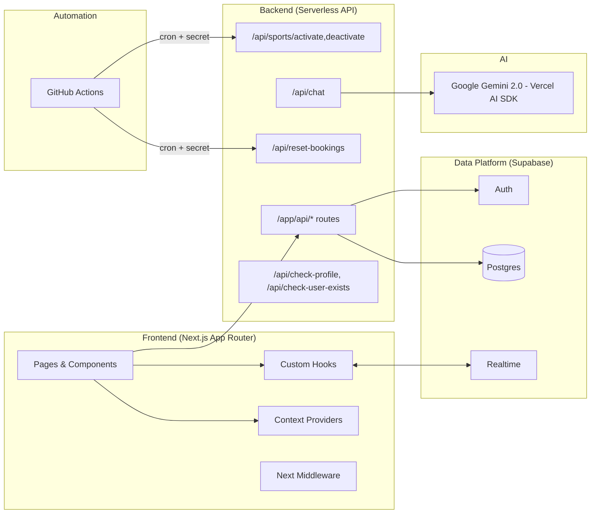


## 4) Use Case Diagram

Roles present in code: user (student/faculty via `profiles.user_type`) and admin. “Coach” listed as a potential future role.

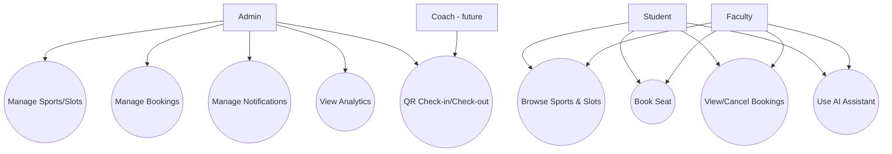


## 5) Folder Structure

```
app/
  (auth)/              # login, signup, forgot/reset, set-password, onboarding, error
  (main)/              # sports, slots, seats, my-bookings (+history), profile (+edit), dashboard, notifications, rules, terms
  admin/               # bookings, bookings-history, slots, sports, notifications, qr-scanner (camera + iot)
  assistant/           # AI assistant UI
  api/                 # serverless API routes (chat, check-profile, check-user-exists, reset-bookings, sports/(de)activate)
  banned/              # restricted access page
  layout.tsx           # root providers (Theme, LoadingBar, Notifications)
  globals.css          # Tailwind CSS v4 baseline
components/
  ui/                  # shadcn UI primitives
  providers/           # LoadingBarProvider, NotificationProvider
  ...                  # navigation, hero, footers, etc.
hooks/
  useRealtimeSubscription.tsx  # robust realtime with reconnection, debounce, health checks
  useCurrentUser.tsx           # client profile fetch + auth listener
lib/
  auth.ts, getUserWithProfile.ts, check-profile.ts, date.ts, utils.ts
utils/supabase/
  client.ts, server.ts, middleware.ts  # SSR cookies/session management
.github/workflows/
  reset-bookings.yml, activate-sports.yml, deactivate-sports.yml
```

Conventions:
- App Router feature partitioning; client/server split through `utils/supabase/*`.
- Context providers for cross-cutting concerns; hooks encapsulate realtime logic.


## 6) Component-Level Design

### 6.1 Component Architecture Overview

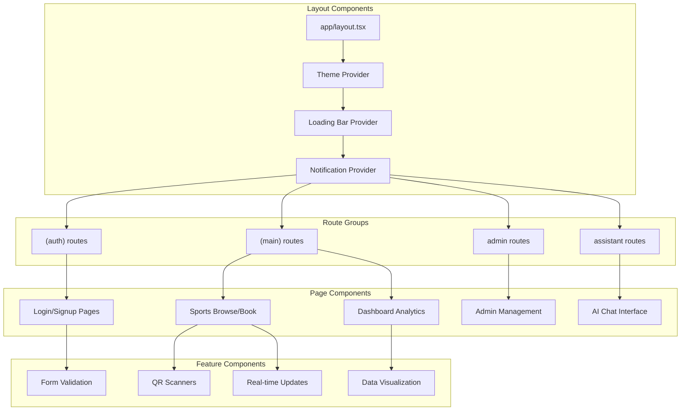

### 6.2 Key Components Detail

Key pages/components:
- Sports Index + Details: `app/(main)/sports/page.tsx`, `sports-page-client.tsx`
- Slots View: `app/(main)/sports/[id]/slots/page.tsx`
  - State: user gender/type, sport name, loading, connection status
  - Hook: `useRealtimeSubscription('slots', ..., 'sport_id', sportId)`
  - Action: navigate to seats
- Seats View: `app/(main)/sports/[id]/slots/[slotId]/seats/page.tsx`
  - State: `seatLimit`, `sportName`, `slotDetails`, realtime bookings, selection
  - Hook: `useRealtimeSubscription('bookings', ..., 'slot_id', slotId)`
  - Validations: gender/user_type, sport/slot `is_active`, time conflict prevention
  - Action: insert into `bookings` then redirect to success
- Notifications Provider: `components/providers/NotificationProvider.tsx`
  - Realtime subscription to `notifications` with caching/debounce
- QR Scanners (Admin):
  - Camera: `app/admin/qr-scanner/camera/page.tsx` — QR video scanning, audio feedback, retries, offline queue
  - Automated: `app/admin/qr-scanner/iot/page.tsx` — input-first, focus management, offline queue

### 6.3 Component Hierarchy

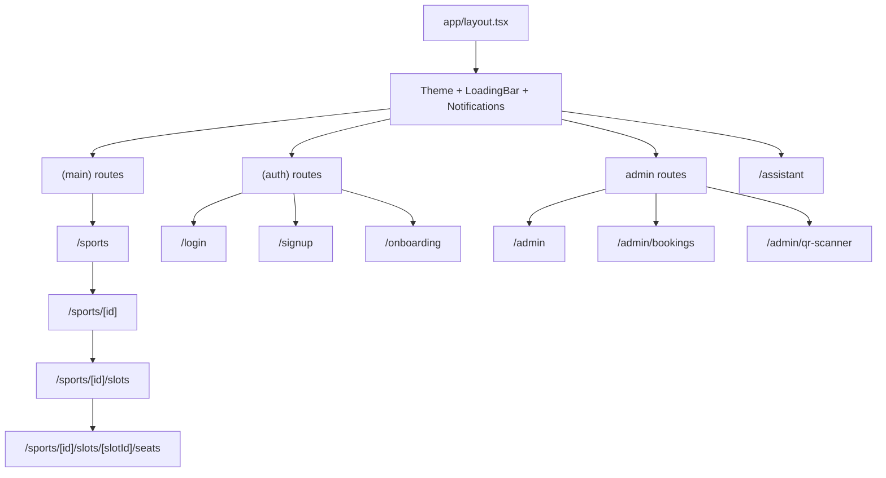

### 6.4 State Management Flow

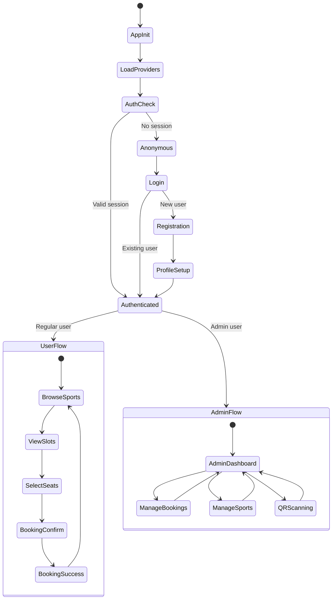


## 7) Routing & Navigation

- Public: `/login`, `/signup`, `/forgot-password`, `/reset-password`, `/set-password`, `/error`, `/banned`
- Main (auth required): `/sports`, `/sports/[id]`, `/sports/[id]/slots`, `/sports/[id]/slots/[slotId]/seats`, `/sports/[id]/slots/[slotId]/success`, `/my-bookings`, `/my-bookings/booking-history`, `/profile`, `/profile/edit`, `/dashboard`, `/notifications`, `/rules`, `/terms`
- Admin (role=admin): `/admin`, `/admin/bookings`, `/admin/bookings-history`, `/admin/slots`, `/admin/slots/add`, `/admin/slots/edit/[id]`, `/admin/sports`, `/admin/sports/add`, `/admin/sports/edit/[id]`, `/admin/notifications`, `/admin/notifications/add`, `/admin/notifications/edit/[id]`, `/admin/qr-scanner`, `/admin/qr-scanner/camera`, `/admin/qr-scanner/iot`
- AI: `/assistant`

Navigation control: `app/middleware.ts` enforces SSR session checks and page access rules.


## 8) Backend/API Design

Implemented API routes:
- POST `/api/chat`: Streams AI responses (Gemini 2.0). Validates/sanitizes input; transforms sports/slots data server-side; audits and rate-limits.
- GET `/api/check-profile`: Validates auth + profile existence, returns JSON directive for client navigation.
- POST `/api/check-user-exists`: `{ email }` → Supabase RPC `user_exists_by_email`.
- POST `/api/reset-bookings`: Archives all `bookings` to `bookings_history` then clears `bookings`. Protected by `BACKUP_CRON_SECRET`.
- POST `/api/sports/activate|deactivate`: Toggle `sports.is_active` (Sunday off/Monday on automation). Protected by `BACKUP_CRON_SECRET`.
- GET `/auth/confirm`: Email OTP flow verification.

Sample request/response (reset bookings)
```http
POST /api/reset-bookings?secret=YOUR_SECRET
200 OK
{
  "success": true,
  "archivedCount": 42,
  "message": "Archived 42 bookings and cleared table."
}
```

Sequence — QR check-in/out (admin)
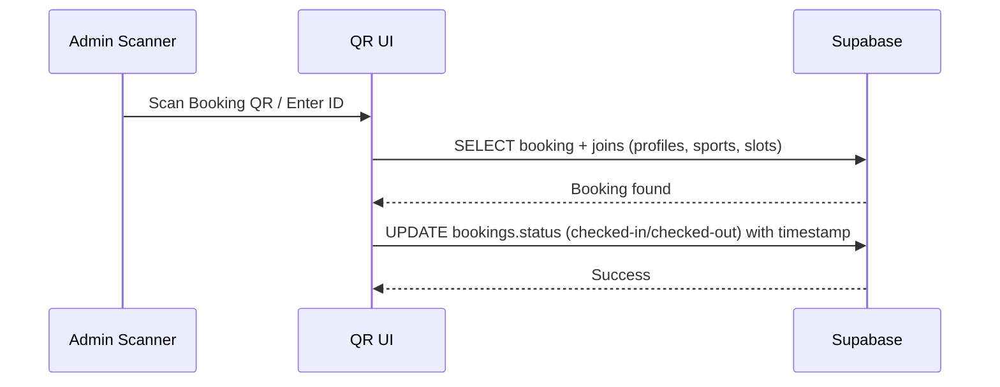

Sequence — OTP verification
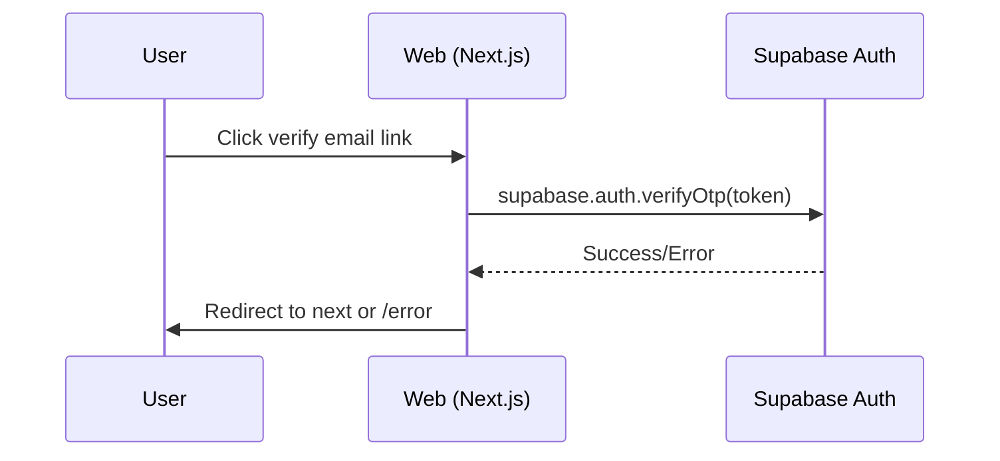


## 9) Database Design

Core tables (from code usage):
- `profiles(id uuid pk, first_name, last_name, gender, user_type, role, prn, course, phone_number, email, created_at)`
- `sports(id uuid pk, name, image_url, seat_limit, is_active, created_at)`
- `slots(id uuid pk, sport_id fk, start_time, end_time, gender, allowed_user_type, is_active, created_at)`
- `bookings(id uuid pk, user_id fk, slot_id fk, sport_id fk, booking_date, seat_number, status, checked_in_at, checked_out_at, created_at)`
- `bookings_history` (archive of bookings)
- `notifications(id, title, message, type, is_active, created_by, created_at)`
- `user_feedback(id, user_id, feedback_text, rating, category, status, created_at)`

Class Diagram
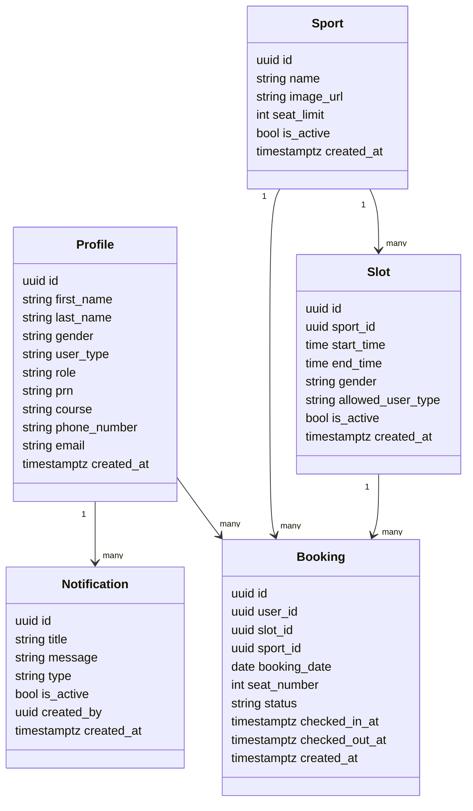

ER Relationships
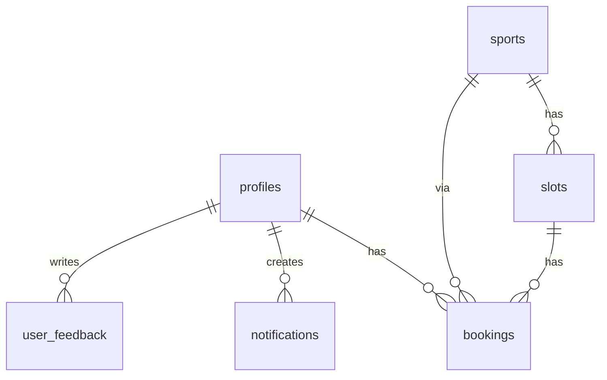

Indexes/Constraints (recommended):
- `bookings` unique (`slot_id`, `booking_date`, `seat_number`) — seat integrity
- `bookings` index (`user_id`, `booking_date`) — user-day queries
- `slots` index (`sport_id`, `is_active`), (`gender`, `allowed_user_type`)
- `sports` index (`is_active`)


## 10) AI Integration

- Endpoint: `/api/chat` via Vercel AI SDK with `google("gemini-2.0-flash")`
- Use cases: Context-aware suggestions, availability summaries, notification awareness, navigation help
- Prompt Logic:
  - Server pre-validates and transforms data: ACTIVE/FULL/EXPIRED status, 12-hour times, eligibility, booking URLs, top-3–5 options
  - Security: prompt injection detection, sanitization, sensitive pattern checks, basic rate limit, audit logs

### AI Request Processing Flow

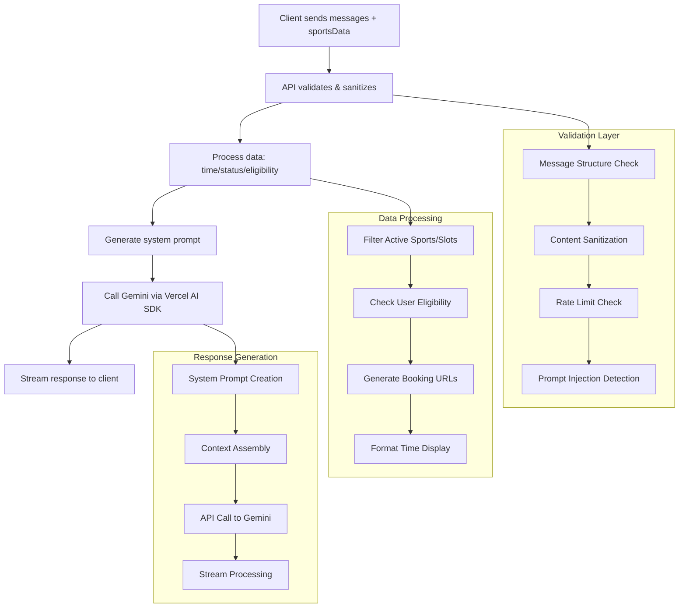

### API Architecture Diagram

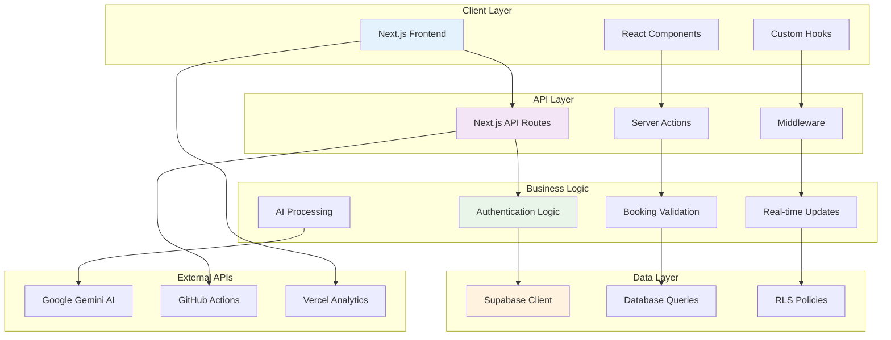


## 11) State Management

- Global: `ThemeProvider`, `LoadingBarProvider`, `NotificationProvider` (in `app/layout.tsx`)
- Realtime: `useRealtimeSubscription` for `slots`, `bookings`, `notifications` (reconnect, debounce, health checks)
- Local: per-page UI state (loading, selections, forms)
- Data access: `utils/supabase/{client,server}.ts` with SSR cookies on server and anon key on client.


## 12) CI/CD and Deployment

- Hosting: Vercel (auto build/deploy on push)
- GitHub Actions: `activate-sports.yml`, `deactivate-sports.yml` (IST-aligned Sunday OFF/Monday ON), `reset-bookings.yml` (nightly archival)
- Secrets: in Vercel (Supabase URL/keys, AI key) and GitHub (API URLs + `BACKUP_CRON_SECRET`)

Deployment Diagram
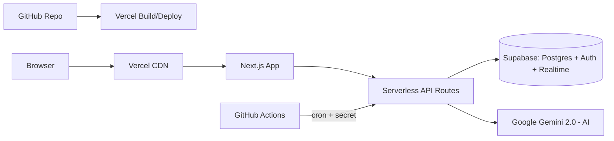


## 13) Testing

- Automated tests: Not present in repository.
- Manual testing tips:
  - Curl POST automation endpoints locally with `?secret=`
  - Realtime: open two sessions and book the same slot to observe seat locking and updates
  - QR scanner: test on localhost (camera works on localhost; HTTPS required in production)


## 14) Monitoring & Performance

- Analytics: Vercel Analytics + Speed Insights
- Performance patterns:
  - Realtime hooks with debounce and reconnect
  - Memoized computations and lazy updates
  - Tailwind CSS 4 + optimized components
  - DB indexing recommendations for frequent queries
- Reliability:
  - AI endpoint audit logs and error handling
  - QR scanners’ offline queue and exponential backoff


## 15) Getting Started Guide (For New Devs)

Prereqs: Node 18+, npm/pnpm, Supabase project

Steps:
1. Clone and install: `npm install`
2. Create `.env.local`:
   - `NEXT_PUBLIC_SUPABASE_URL`
   - `NEXT_PUBLIC_SUPABASE_ANON_KEY`
   - `SUPABASE_SERVICE_ROLE_KEY`
   - `BACKUP_CRON_SECRET`
   - `GOOGLE_GENERATIVE_AI_API_KEY`
3. Run: `npm run dev` → http://localhost:3000

Tips:
- If redirected to `/login`, verify middleware and session
- If data/auth fails, check Supabase envs
- For scanners, check console logs for permission/conflict issues

Contributing:
- Follow App Router feature boundaries
- Use `useRealtimeSubscription` for live data
- Add DB indexes/constraints when adding heavy queries


## 16) Appendix

- Glossary:
  - Slot: Time window for a sport on a given date
  - Seat: Bookable spot within a slot
  - Check-in/Check-out: Attendance state changes via QR
- Roadmap/Future Enhancements:
  - Server-side hardening for conflict checks
  - Structured logging/alerts for APIs
  - CI export of Mermaid diagrams to PNG/SVG for Word/PDF handovers
  - Additional roles (e.g., Coach), team events/leaderboards
- Ownership:
  - Original Creator: Subhajit Dolai
  - Owner/Maintainer: MIT World Peace University (MIT-WPU)

---
This Design Document reflects the current codebase and is suitable for company submission, handover, and future planning.
