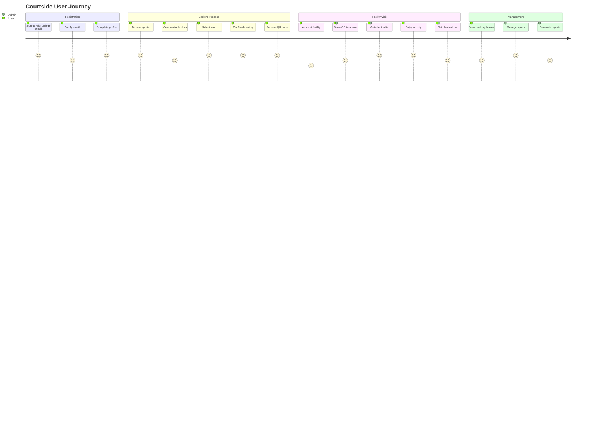
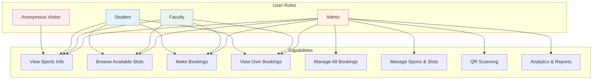
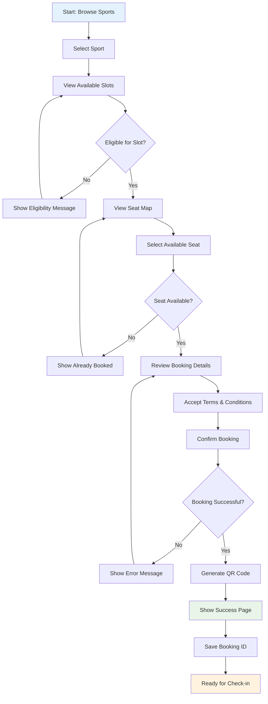
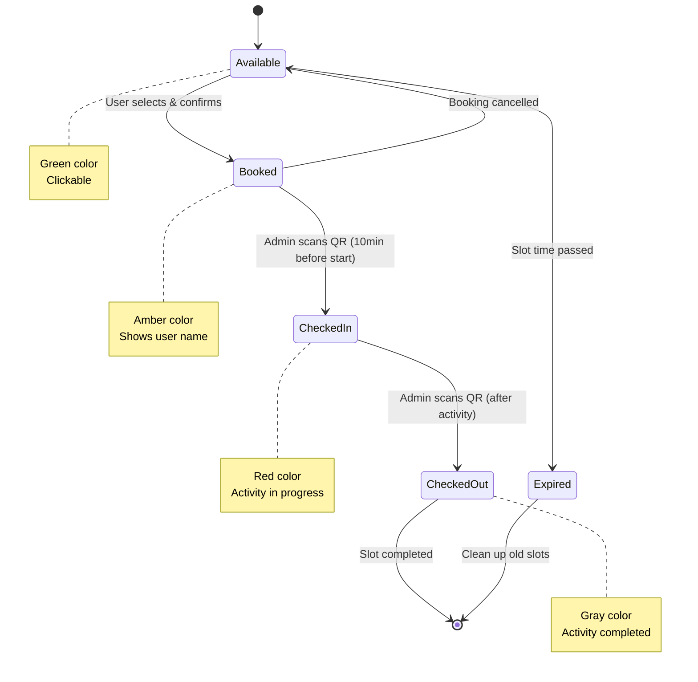
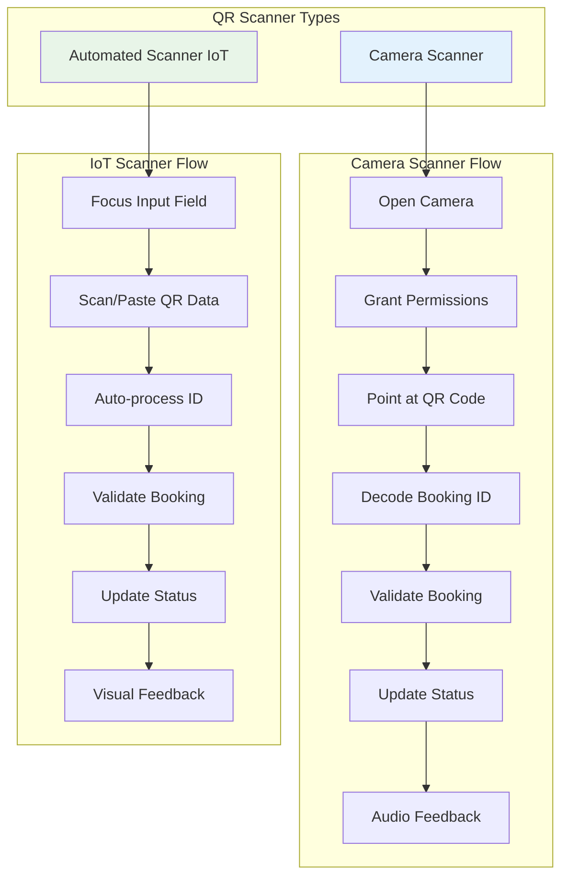
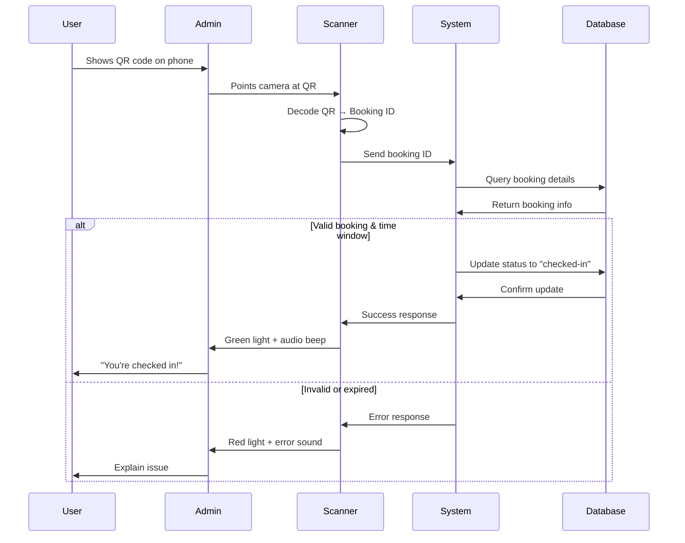
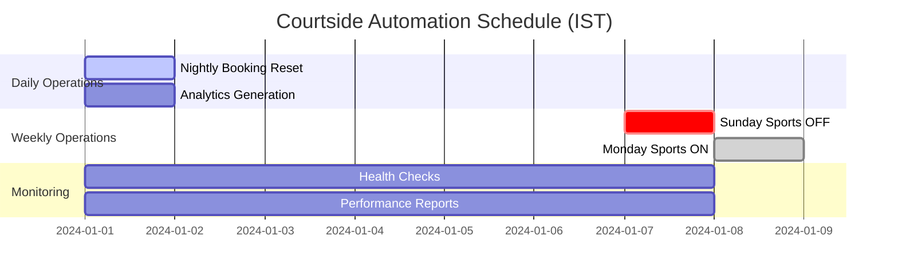
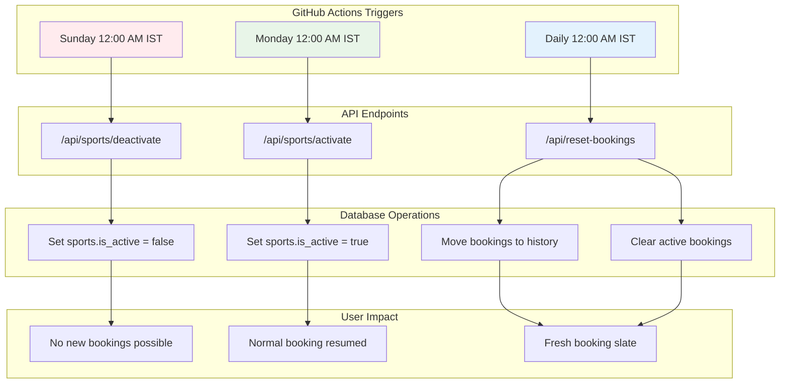
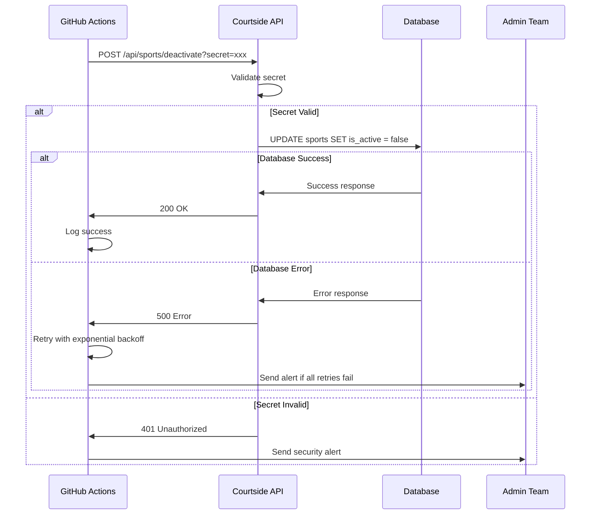

# Courtside User Manual

Version: 1.0
Website: https://sports.mitwpu.edu.in
Owner/Maintainer: MIT-WPU — sports.mitwpu.edu.in
Original Creator: Subhajit Dolai

## 1) Introduction
Welcome to Courtside — MIT-WPU's sports facility booking platform. This guide explains how students, faculty, and admins can use all features end‑to‑end, including booking, attendance, notifications, and administration.

### User Journey Overview

### User Types and Capabilities

Audience
- Students & Faculty (Users)
- Admins (Sports Office/Facility Managers)
- Support/Operations staff

Supported devices: Modern desktop and mobile browsers. Camera features require HTTPS (production) or localhost (development).

## 2) Getting Started

### Sign In / Sign Up
- Visit `/login` to sign in.
- New users: go to `/signup` and complete registration. Verify email if prompted.
- Forgot password: `/forgot-password` → follow instructions; finalize via `/reset-password` link from email.
- Invitation link (set password): `/set-password?token=...`

### Onboarding (First Time Users)
If redirected to `/onboarding`, provide required profile info:
- First/Last name
- User type (student/faculty)
- Course/Department and PRN/Employee ID
- Gender and contact details

Once complete you’ll be redirected to the main app.

## 3) Sports and Time Slots

### Browse Sports
- Go to `/sports` to see all available sports.
- Sports may be temporarily deactivated institution‑wide (e.g., Sunday OFF). If a sport is inactive, booking is not allowed.

### View Slots for a Sport
- Open a sport → `/sports/[id]/slots`
- Slots show time ranges and eligibility badges:
  - Gender: `male` / `female` / `any`
  - Allowed user type: `student` / `faculty` / `any`
- Live connection indicator shows realtime status.

## 4) Booking a Seat (Spots)

### Booking Process Flow

### Seat Status System

### Seat Selection
- From `/sports/[id]/slots`, choose a slot → `/sports/[id]/slots/[slotId]/seats`
- Seat colors:
  - Green: Available
  - Amber: Booked
  - Red: In use (checked‑in)
  - Gray: Finished (checked‑out)

### Rules & Validations
- Eligibility: You must match the slot's `gender` and `allowed_user_type` (or the slot must be `any`).
- Time window: Check‑in opens 10 minutes before the slot's start; expired slots cannot be booked.
- One seat per user per slot per day. The system prevents duplicates and conflicting overlapping bookings.
- Some sports include specific terms (e.g., swimming pool hygiene, wrestling mats). You must accept Terms & Conditions before confirming.

### Confirming a Booking
1) Select a seat number.
2) Read and accept Terms & Conditions.
3) Click Confirm. On success, you'll be redirected to the success page with a QR link.

### Booking Confirmation & QR
- After a successful booking, you'll see a success page at `/sports/[id]/slots/[slotId]/success?booking_id=...`.
- The QR code/URL is used at the facility for check‑in and check‑out.

## 5) My Bookings & History

- Current bookings: `/my-bookings`
  - View upcoming bookings; cancel within allowed time if enabled.
- Booking history: `/my-bookings/booking-history`
  - View archived/previous bookings and status.

## 6) QR Check‑in / Check‑out (On Facility)

- Admin scans your booking QR or enters your booking ID in the scanner system.
- You can check in starting 10 minutes before the slot’s start time.
- Check‑out after you finish. Status transitions: `booked → checked‑in → checked‑out`.

Tip: Arrive with your booking QR ready on your phone. If the QR is not available, provide your booking ID to the admin.

## 7) Notifications

- View all announcements at `/notifications`.
- Types: `urgent`, `maintenance`, `general`.
- The bell in the UI indicates whether active notifications exist.

## 8) AI Assistant

- Open `/assistant` to chat with Courtside AI.
- You can ask:
  - “What sports have slots open now?”
  - “Show me badminton options at 5 PM.”
  - “Any urgent notices today?”
- The assistant considers your eligibility and shows only valid booking links, never expired/full slots.

## 9) Profile & Settings

- View profile at `/profile`; edit details at `/profile/edit`.
- Keep contact details updated for communications and verification.

## 10) Admin Guide

Admin access requires `role = admin` in the user profile.

### Admin Dashboard & Areas
- Home: `/admin`
- Bookings (live): `/admin/bookings`
  - View current bookings; open details dialogs.
- Bookings History: `/admin/bookings-history`
  - Filter and review archived records.
- Sports Management: `/admin/sports`
  - Add: `/admin/sports/add`
  - Edit: `/admin/sports/edit/[id]`
  - Toggle activation (affects visibility/booking availability)
- Slots Management: `/admin/slots`
  - Add: `/admin/slots/add`
  - Edit: `/admin/slots/edit/[id]`
  - Fields: start/end time, gender, allowed user type, is_active
- Notifications: `/admin/notifications`
  - Add: `/admin/notifications/add`
  - Edit: `/admin/notifications/edit/[id]`
  - Toggle `is_active` to show/hide for users.

### Admin QR Scanners

### QR Scanning Process

- Scanner Hub: `/admin/qr-scanner`
- Camera Scanner: `/admin/qr-scanner/camera`
  - Allow camera permissions; prefer back camera on mobile.
  - Controls: Start, Stop, Switch camera, Retry.
  - Audio feedback confirms a scan; large, accessible UI.
  - Troubleshooting: Close other camera-using apps; try switching cameras.
- Automated Scanner: `/admin/qr-scanner/iot`
  - For wedge scanners; focuses an input field.
  - Paste/scan booking ID (UUID) to process.
  - Manual Start/Stop controls; offline queue and retry.

### Attendance Rules
- Check‑in allowed only from 10 minutes before start time.
- Validate that sport/slot is active.
- Prevent repeated check‑ins or check‑outs.

## 11) Institutional Automations (Background)

### Automation Schedule Overview

### Automation Flow Diagram

### Automation Error Handling

- Sunday OFF / Monday ON
  - Sports deactivated on Sunday 12:00 AM IST; reactivated Monday 12:00 AM IST.
  - Admin override is possible via sports activation toggles.
- Nightly Archival
  - Completed bookings are moved from `bookings` to `bookings_history` at midnight IST.

Note: These run via GitHub Actions calling protected APIs with a secret. If schedules change (holidays), admins can toggle sports manually.

## 12) Tips & Troubleshooting

- I can’t see any sports or slots:
  - It may be Sunday OFF timing or sports are temporarily deactivated. Check `/notifications` for notices.
- Booking fails with “someone just booked this spot”:
  - Real-time concurrency: select a different seat.
- Can’t check in yet:
  - Check‑in starts 10 minutes before the slot begins.
- Camera doesn’t work on the scanner page:
  - Ensure site uses HTTPS (production) or `localhost` (development). Grant camera permissions.
- Session issues (redirects to `/login`):
  - Sign in again; ensure cookies are allowed.
- Banned page `/banned`:
  - Your account may be restricted. Contact sports administration.

## 13) Best Practices

- Book only if you plan to attend; cancel if you can’t make it.
- Arrive early to avoid missing the check‑in window.
- Respect facility rules (e.g., non‑marking shoes, hygiene).
- Keep profile info updated for eligibility checks.

## 14) Contact & Support

- For booking or account issues: Reach out to the sports administration office or designated support channel.
- Provide your booking ID and sport/slot details for faster assistance.

## 15) Glossary

- Sport: A facility type (e.g., badminton, swimming, wrestling)
- Slot: A time window allocated to a sport on a day
- Seat/Spot: An individual bookable position inside a slot
- Check‑in/Check‑out: Attendance states recorded against a booking via QR
- Eligibility: Gender and user type requirements (or `any`)

## 16) Quick Links

- Login: `/login`
- Signup: `/signup`
- Sports: `/sports`
- My Bookings: `/my-bookings`
- Booking History: `/my-bookings/booking-history`
- Notifications: `/notifications`
- Profile: `/profile` / `/profile/edit`
- Assistant: `/assistant`
- Admin: `/admin`
- Admin QR Scanners: `/admin/qr-scanner/camera` and `/admin/qr-scanner/iot`

---
This manual covers all user and admin operations. For internal technical details, refer to `Courtside_Design_Document.md` and `Courtside_Architecture.md`.
